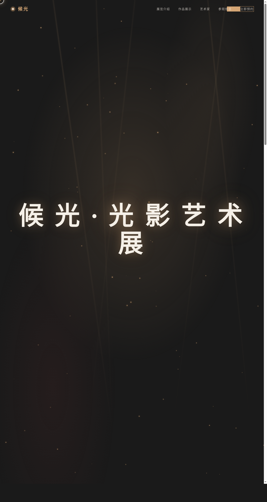

# 候光·光影艺术展 Houguang Light & Shadow Exhibition

> 日期：2026-08-17 · 方向：V1 网页设计 · 主题：光影艺术展览官网

## 简介

「候光·光影艺术展」是一个沉浸式光影艺术展览官网，围绕"光与影的对话"主题，展示6件光影装置艺术作品。网站采用炭墨黑+暖金的暗色调配色，营造光影交织的艺术氛围。纯 vanilla HTML/CSS/JS 单文件实现，无框架依赖。

## 截图

## 配色方案

- 炭墨黑 `#1a1a1a` + 暖金 `#d4a574` + 雪花白 `#f5f0e8` + 深绛红 `#8b3a3a`

## 动效亮点

- 自定义光标：白色粗环+金色内点+多层发光，开页即显示在屏幕中央
- 粒子光尘漂浮（80颗金色微粒，微扰动+鼠标近避）
- 3D倾斜作品卡（鼠标位置映射rotateX/Y）
- 光束扫射（5道光束缓慢摆动+鼠标跟随）
- 打字机标题、数字计数器、视差滚动、涟漪点击、标题脉冲发光

## 妙搭在线预览

https://dcniaqwtmoca.feishu.cn/page/EsGQmVqIbdaFrzaRsYUcXoNFnJe

## 文件说明

| 文件 | 说明 |
|------|------|
| index.html | 完整网站源码（纯 vanilla HTML/CSS/JS 单文件） |
| 设计规范.md | 色彩系统、字体、组件、动效、页面结构设计规范 |
| preview.png | 页面截图（1280×2400） |
| thumbnail.png | 缩略图（1280×720） |
| README.md | 本说明文件 |

## 技术栈

- 纯 vanilla HTML/CSS/JS，无 React/Babel/CDN 依赖
- 字体：Noto Serif SC（标题）+ Noto Sans SC（正文）
- 动效：requestAnimationFrame + IntersectionObserver + CSS transitions
