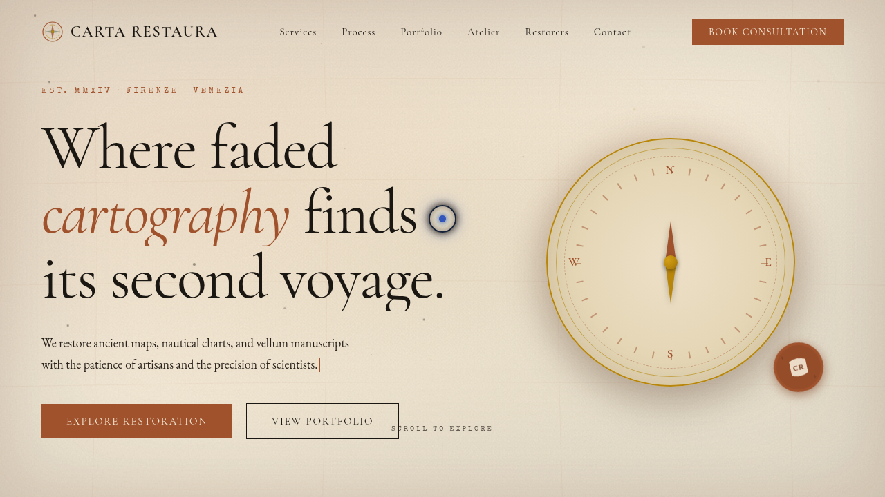

# 古地图修复所 Carta Restaura

> 日期：2026-08-17 · 方向：V1 网页设计 · 主题：古地图修复工坊官网

## 简介

一家专注于古地图、航海图、手绘羊皮纸地图修复与复刻的工坊官网。以羊皮纸质感为视觉基调，赭石红与墨绿点缀，营造古典修复工坊的沉浸氛围。

## 截图

## 动效亮点

- 磁悬浮罗盘：磁针按反平方引力律跟随鼠标偏转
- 火漆印盖章：弹簧弹跳动画
- Before/After 拖拽对比：clip-path 实时切换修复前后
- 墨尘粒子漂浮：30 粒正弦运动，不同周期
- 经纬线 SVG 绘制动画
- 自定义光标：弹簧跟随 + 悬停三态切换 + 点击涟漪

## 在线预览

https://dcniaqwtmoca.feishu.cn/page/HkXTmNed2dGwgVaUHgscCge6n6c

## 文件说明

| 文件 | 说明 |
|------|------|
| index.html | 完整单页网站源码（含内联 CSS/JS） |
| preview.png | 页面截图 |
| thumbnail.png | 缩略图 |
| 设计规范.md | 色彩/字体/组件/动效规范 |

## 技术栈

纯 vanilla HTML/CSS/JS 单文件，零外部依赖（仅 Google Fonts CDN）。
