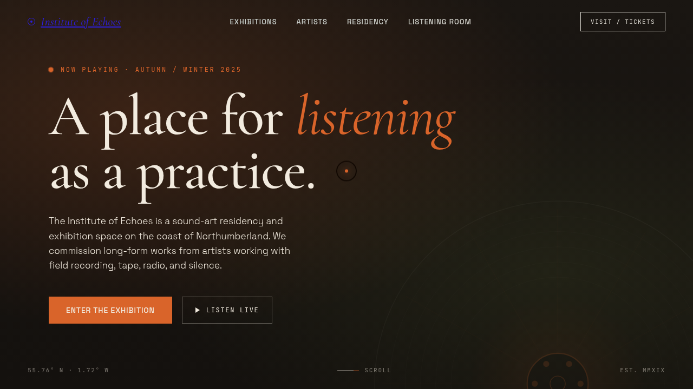

# 回声研究所 Institute of Echoes

> 日期：2026-08-17 · 方向：V1 网页设计 · 主题：声音艺术驻留与展览机构官网

## 简介

「回声研究所」是一个虚构的声音艺术驻留与展览机构官网。围绕声音艺术组织真实可信内容——频谱英雄区、展览卡片、驻留艺术家、驻留项目、试听室（真转动黑胶 + 唱针落下 + 播放列表）。单页到底，艺术品级。

## 截图

## 动效亮点

- 64 根频谱柱独立弹簧振荡（英雄区）
- 真转动黑胶 + 唱针落下 + 播放/暂停（试听室）
- 自定义光标：弹簧阻尼跟随，白环 + 赭点 + 多层发光，悬停三态切换 + 点击涟漪
- 磁性按钮（反平方引力）、卡片 3D 倾斜、打字机、数字计数、跑马灯 hover 暂停

## 文件说明

| 文件 | 说明 |
|---|---|
| index.html | 完整可运行源码（React + Babel 内联，CSS 内联） |
| preview.png | 页面截图 |
| thumbnail.png | 缩略图 |
| 设计规范.md | 色彩/字体/动效/页面结构规范 |

## 妙搭在线预览

https://dcniaqwtmoca.feishu.cn/page/B1z9mrOfHdbR11aGJtwcU4L5nFe

## 技术栈

React 18 + Babel standalone（JSX 内联），CSS 内联，无外部组件文件。
