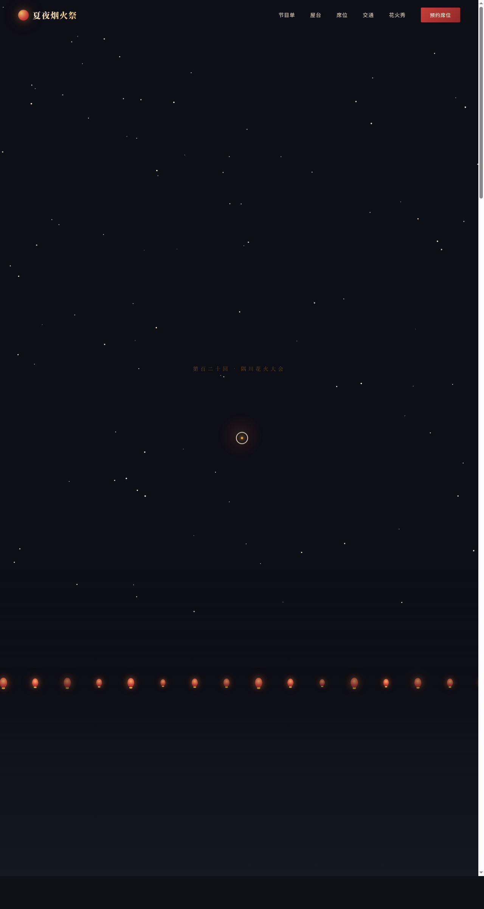

# 夏夜烟火祭 Hanabi Night · 仲夏河畔烟火大会官网

> 日期：2026-08-17 · 方向：V1 网页设计 · 主题：仲夏夜河畔烟火大会活动官网

## 简介

单页长滚的烟火大会活动官网：Hero 首屏实时烟花粒子画布 + 河岸摇曳灯笼，倒计时、五幕烟火节目时间轴、六间屋台摊位、三档观赏席位与可视化座位图、交通指南，末尾全屏花火秀可点击发射。夜空墨黑 + 茜红 + 烟火金的烟火夜气质。

## 截图

## 动效亮点

自定义光标（弹簧三层跟随）、烟花粒子系统（重力+摩擦+四种爆炸模式）、河岸灯笼摇曳、打字机标题、数字计数、倒计时、卡片 3D 倾斜、滚动渐入、萤火虫浮动、光泽扫过、Logo 脉冲、河面波纹，共 14 个组件级特效。

## 妙搭在线预览

https://dcniaqwtmoca.feishu.cn/page/S6X4mIKLSd0o9Ua98a9coYAtnhe

## 文件说明

| 文件 | 说明 |
|------|------|
| index.html | 完整源码（内联 CSS + JS，单文件） |
| preview.png | 页面截图 |
| 设计规范.md | 色彩/字体/组件/动效规范 |
| thumbnail.png | 平台自动缩略图 |

## 技术栈

纯 HTML + CSS + JavaScript（vanilla，无框架依赖），Canvas 烟花粒子系统，IntersectionObserver 滚动驱动，RAF 统一管理。
