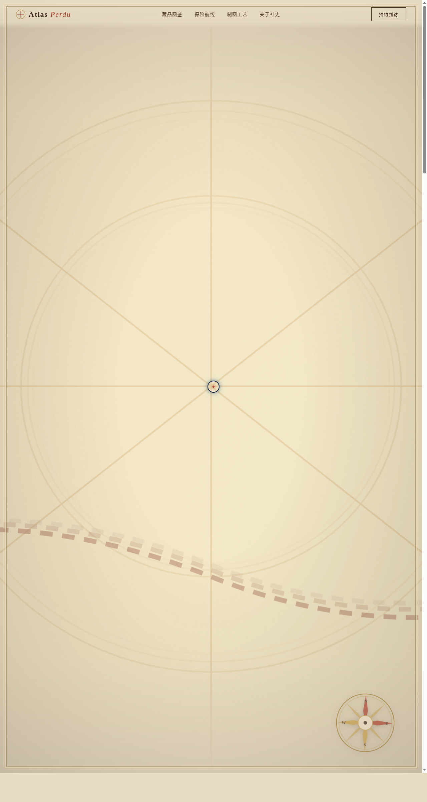

# 失落地图社 Atlas Perdu

> 日期：2026-08-17 ｜ 方向：V1 网页设计 ｜ 主题：古董制图与探险地图收藏品牌站

## 简介

一个真实可交互的古董制图社品牌网站：首屏三层古地图视差 + 旋转罗盘玫瑰；藏品图鉴收录 9 张真实可信的古地图（含年代 / 制图师 / 工艺 / 价格），7 类筛选，点击卷轴式展开详情；探险航线模块可切换 5 条著名航线，SVG 路径动态绘制 + 虚线流动；制图工艺四章节故事。羊皮纸暖系配色（羊皮纸米黄 + 深棕墨 + 锈红 + 铜绿 + 金箔），无蓝紫渐变。

## 截图

## 动效亮点

自定义光标（开屏居中显示，白环 + 锈红内点 + 金色发光）、Hero 三层地图视差、罗盘自转、藏品卡片 3D 倾斜 + 光泽扫过、打字机导语、数字计数、滚动渐入、按钮金色光泽、点击涟漪、航线路径 SVG 绘制 + 虚线流动、扬尘粒子、模态卷轴展开、导航栏滚动渐变——共 14 个组件级特效。支持 `prefers-reduced-motion` 降级；RAF / 定时器随 `visibilitychange` 暂停。

## 文件说明

| 文件 | 说明 |
|---|---|
| index.html | 完整源码（React + 内联 JSX + 内联 CSS） |
| preview.png | 页面截图（1280×2400） |
| thumbnail.png | 平台缩略图 |
| 设计规范.md | 色彩 / 字体 / 组件 / 动效 / 页面结构规范 |

## 妙搭在线预览

https://dcniaqwtmoca.feishu.cn/page/RmXsmlB90dnvIZaJzEycaUBcncd

## 技术栈

React 18 + Babel standalone（内联 JSX）+ 纯 CSS，单文件 index.html。
