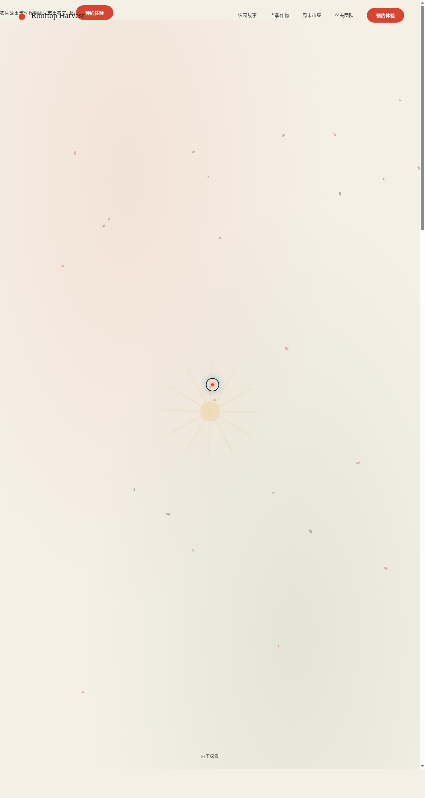

# Rooftop Harvest 屋顶农场

- **日期**：2026-08-17
- **方向**：V1 网页设计
- **主题**：城市屋顶农园品牌官网——在高楼天台种番茄、罗勒与向日葵的城市农场

在高楼天台之上，一座 2800㎡ 的城市农园。番茄红 + 罗勒绿 + 麦乳白的暖田园配色，DM Serif Display 衬线展示字呼应有机农园的质朴与精致。全站为单页艺术品级官网：农园故事、当季作物、周末市集、农夫团队、采收体验预约，内容全部真实可信。

## 动效亮点

- 自定义光标：白色粗环 + 番茄红内点 + 多层发光，开页即居中，悬停放大、点击涟漪
- Canvas 飘落叶片粒子（正弦摆动 + 旋转）；打字机标题四组词轮播
- 数字计数（2800㎡ / 47+ 品种 / 12 位农夫）；作物卡片 3D 倾斜 + 斜向光泽扫过
- 藤蔓生长 SVG 描边动画；阳光射线 60s 缓旋；头像脉冲光环
- 导航滚动紧凑化（RAF 节流）；全站 13 个组件级特效

## 文件说明

| 文件 | 说明 |
|---|---|
| `index.html` | 完整单页站点（React 18 + Babel 内联 JSX，CSS 内联） |
| `设计规范.md` | 色彩系统 / 字体 / 组件 / 动效 / 页面结构 |
| `preview.png` | 页面截图（1280×2400） |
| `README.md` | 本文件 |

## 在线预览

https://dcniaqwtmoca.feishu.cn/page/WOUVmSzjgd00dIaOS6ocUlfpn00

## 技术栈

React 18 + Babel standalone（JSX 全内联）+ Canvas 粒子 + SVG 描边动画 + IntersectionObserver，visibilitychange 暂停、prefers-reduced-motion 降级。
