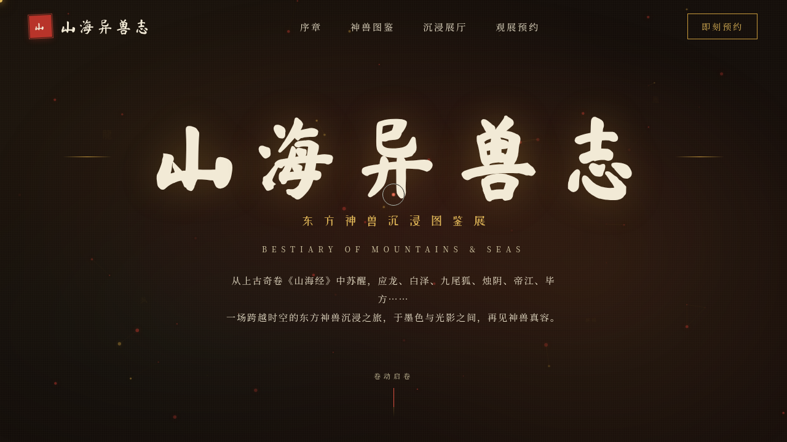

# 山海异兽志 · 东方神兽沉浸图鉴展

> 日期：2026-08-17 · 方向：V1 网页设计 · 主题：东方神兽图鉴沉浸展官网

以《山海经》神兽为题的沉浸式图鉴展官网。围绕应龙、白泽、九尾狐、烛阴、帝江、毕方等十二神兽组织真实考据内容，含序章卷轴、神兽图鉴、沉浸展厅、观展预约四大板块。

## 截图

## 动效亮点

- 自定义光标：白环 + 赭金内点 + 六层粒子尾迹，弹簧阻尼跟随，悬停三态切换
- Hero 粒子网络：金红双色粒子 + 距离连线频谱
- 神兽卡片 3D 倾斜（RAF 弹簧积分器）+ 鳞片光泽扫过
- 数据条填充 + 数字计数（easeOutCubic）
- 卷轴序章展开、打字机、滚动渐入、神坛光环脉冲

## 在线预览

https://dcniaqwtmoca.feishu.cn/page/LeUOmUfeYdiSlras5djcBSulnNf

## 文件说明

| 文件 | 说明 |
|------|------|
| index.html | 完整可运行源码（HTML + 内联 CSS + 内联 Babel JSX） |
| 设计规范.md | 色彩系统、字体、组件、动效、页面结构 |
| thumbnail.png | 页面截图 |

## 技术栈

React 18 + Babel standalone（全部内联），纯前端单文件，无外部 JSX/CSS 引用。
