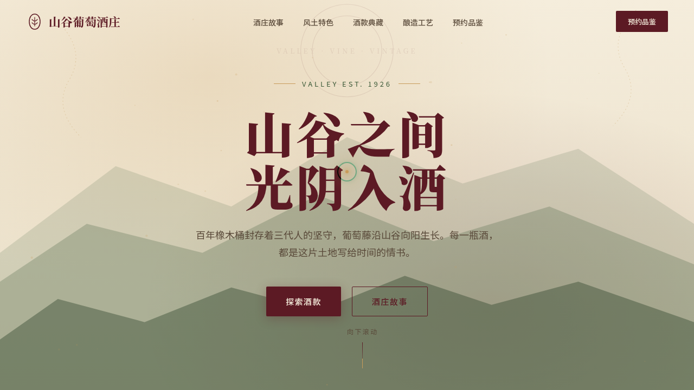

# 山谷葡萄酒庄 Valley Winery · 网页设计

> 日期：2026-08-17 · 方向：V1 网页设计 · 主题：百年山谷葡萄酒庄品牌官网

## 简介

「山谷葡萄酒庄」是一座虚构的百年山谷酒庄品牌官网。以勃艮第酒红 + 藤叶绿 + 橡木金 + 羊皮纸的冷暖对比营造酒庄质感，含酒庄故事、风土特色、酒款典藏（红/白/桃红筛选 + 详情模态）、酿造工艺、预约品鉴等板块。整页艺术品级单页，真实可交互。

## 动效亮点

- 自定义光标：白环 + 金色内点 + 多层发光，开页即居中显示，悬停放大、点击涟漪
- Hero 浮尘粒子 + 打字机副标题 + 视差背景
- 酒款卡片 3D 倾斜（直接 DOM transform）+ 光泽扫过 + 弹簧模态窗
- 磁性按钮（光标吸附 + 回弹）
- 数字计数、滚动错峰渐入、导航滚动收缩

## 文件说明

| 文件 | 说明 |
|------|------|
| index.html | 单页源码（内联 CSS + Babel/React JSX） |
| thumbnail.png | 页面截图 |
| 设计规范.md | 色彩 / 字体 / 组件 / 动效规范 |

## 妙搭在线预览

https://dcniaqwtmoca.feishu.cn/page/EyFBmanYEde9bla9U99cO9adnLf

## 技术栈

单文件 HTML + 内联 CSS + 内联 Babel/React JSX，无外部 JSX 引用。
