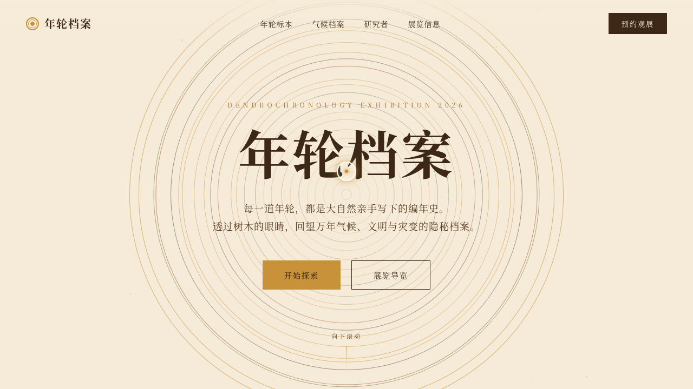

# 年轮档案 Ring Archive

> 日期：2026-08-17 · 方向：V1 网页设计 · 主题：树木年轮年代学展览网站

「年轮档案 Ring Archive」是一个树木年轮年代学（dendrochronology）展览网站，通过树木年轮解读气候历史、文明变迁与自然灾害档案。页面包含 Hero 区年轮同心圆展开动画、年轮标本画廊（可交互卡片）、气候时间轴、研究者文章区和展览信息区。

## 截图

## 动效亮点

- 自定义光标（白色粗环 + 琥珀色内点 + 多层发光，hover 变形，点击涟漪）
- Hero 年轮同心圆 RAF 展开动画
- 木屑粒子飘落背景
- 标本卡片 hover 旋转 + 光泽扫过 + 发光
- 数字计数器（树龄/标本数量）
- 滚动视差与渐入
- 研究者头像脉冲

## 在线预览

[年轮档案 Ring Archive](https://dcniaqwtmoca.feishu.cn/page/BjP0m5kalddoVLaywTQcXMCQnvb)

## 文件说明

| 文件 | 说明 |
|------|------|
| index.html | 完整可运行的源代码（纯 HTML/CSS/JS 单文件） |
| preview.png | 页面截图 |
| thumbnail.png | 缩略图 |
| 设计规范.md | 设计规范文档 |

## 技术栈

纯 HTML/CSS/JS 单文件实现，无 React/Babel/CDN 依赖。Canvas API + IntersectionObserver + requestAnimationFrame，支持 prefers-reduced-motion 降级。
