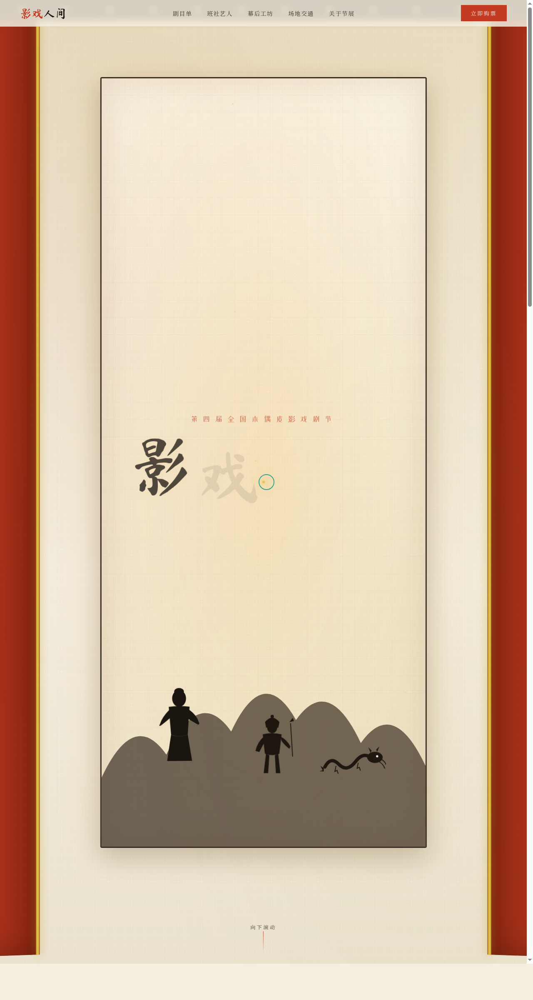

# 影戏人间 · 木偶与皮影戏剧节官网

> 日期：2026-08-17 · 方向：V1 网页设计 · 主题：木偶与皮影戏剧节沉浸式官网

## 简介

「影戏人间」是一个木偶与皮影戏剧节的沉浸式单页官网。以宣纸米白为底、朱红墨黑为主、鎏金点缀，营造幕布后灯影摇曳的东方剧场氛围。内容涵盖开幕大剧、剧目单（皮影《山海经》折子、提线木偶、布袋戏、杖头木偶）、参展班社、票务、幕后工坊与场地交通，全部真实可交互。

## 动效亮点

- 幕布拉开揭幕动画 + 皮影剪影 4 层差速视差
- 自定义光标（朱红粗环 + 鎏金内点 + 暖光外晕，hover/ click 三态）
- 剧目卡片 3D 倾斜 + 光束扫过
- 金色粒子浮游、数字计数、打字机、汉字逐字入场
- 共 18+ 组件级特效，基于 RAF/弹簧/主题语义

## 文件说明

| 文件 | 说明 |
|---|---|
| index.html | 完整可运行源码（React + Babel 内联） |
| 设计规范.md | 色彩/字体/组件/动效规范 |
| preview.png | 页面截图（1280×2400） |
| thumbnail.png | 平台缩略图 |

## 妙搭在线预览

https://dcniaqwtmoca.feishu.cn/page/VKa5mwAgldwkfRak1XNcgumnnxe

## 技术栈

React 18 + Babel standalone，JSX 内联于 `<script type="text/babel">`，单文件无构建。
