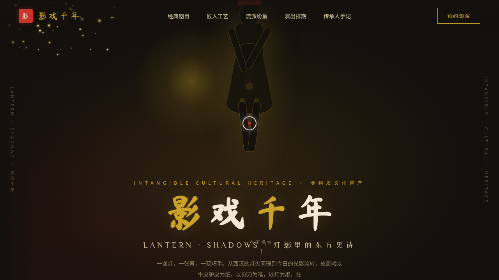

# 影戏千年 Lantern Shadows · README

> 日期：2026-08-17｜方向：V1 网页设计｜主题：中国皮影戏非遗沉浸式官网

## 简介

「影戏千年」是一座中国皮影戏非遗沉浸式单页官网。浓墨夜幕为底，朱砂灯笼点亮皮影影人，鎏金描边勾出镂空剧目卡。用户可拖动 Hero 区影人的双臂（铰链物理回弹），鼠标移动时灯笼光源实时照亮剪影；剧目卡 hover 时背后金光从镂空处透出，工艺流水线的六道工序以刀痕绘制动画依次连起。内容围绕真实皮影剧目、流派与国家级非遗传承人组织。

## 配色

浓墨黑 `#14100C` · 宣纸米 `#F2E8D5` · 朱砂红 `#C7352B` · 鎏金 `#C9A227`（详见 设计规范.md）

## 动效亮点

- 皮影关节可拖拽摆动（铰链物理，松手回弹 + 空闲自然摆动）
- 灯笼光源跟随鼠标，实时照亮 Hero 皮影
- 剧目卡镂空透光 + 斜向金色光泽扫过
- 60 颗金色灯尘粒子上升（Canvas）
- 工序虚线 path 滚入绘制
- 数字计数 easeOutExpo、打字机、头像双环脉冲
- 自定义光标（开页居中、悬停三态、点击涟漪）

## 文件说明

| 文件 | 说明 |
|---|---|
| index.html | 完整可运行源码（单文件，CSS/JS 全内联） |
| 设计规范.md | 色彩系统、字体、组件、动效、页面结构 |
| preview.png | 页面截图 |
| thumbnail.png | 平台生成缩略图 |

## 在线预览

https://dcniaqwtmoca.feishu.cn/page/JeI5mfUF6dJRjvaQgbucEGFHnMf

## 技术栈

纯 HTML/CSS/JavaScript（Canvas + DOM transform），无外部框架依赖。
