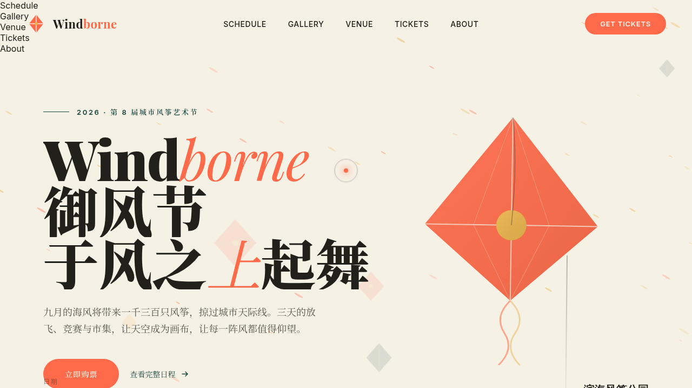

# Windborne 御风节 · 城市风筝节官网

- **日期**：2026-08-17
- **方向**：V1 网页设计
- **主题**：城市风筝节「Windborne 御风节」官方网站——单页艺术品级节庆官网
- **配色**：珊瑚红 `#FF6B4A` + 深松绿 `#17443A` + 米纸白 `#F6F1E5` + 墨色 `#22201B` + 麦金 `#E8B34B`

## 简介

为一场为期三日的城市风筝节而设计的官方网站。围绕「风」组织全部内容：实时风况条（风速/风向/放飞指数）、三日 12 场活动日程、5 款 SVG 风筝画廊、带定位图钉的放飞场地地图、三档票种与开幕倒计时。全部内容真实可信，无占位文字。

## 动效亮点

- 画布风粒子系统 + 弹簧物理光标跟随（RAF 积分器）
- Hero 风筝视差漂浮、风筝线摇摆、天空多层风筝正弦漂移
- 日程卡 / 画廊 / 票卡 3D 倾斜，场地地图鼠标视差
- 自定义光标（白环 + 珊瑚红内点 + 多层发光，开页即居中，悬停三态，点击涟漪）
- 倒计时实时递减、评价无限滚动、按钮光泽扫过等 15+ 组件级特效

## 妙搭在线预览

https://dcniaqwtmoca.feishu.cn/page/A5rAmKQjDdnE2Ya75pBciz1bn1V

## 文件说明

| 文件 | 说明 |
|------|------|
| `index.html` | 完整单文件源码（内联 CSS/JS），可直接在浏览器打开预览 |
| `设计规范.md` | 色彩 / 字体 / 页面结构 / 动效系统 / 健壮性规范 |
| `preview.png` / `thumbnail.png` | 页面截图 |
| `README.md` | 本文件 |

## 技术栈

原生 HTML / CSS / JavaScript 单文件，Canvas 粒子，SVG 插画，无外部依赖。
