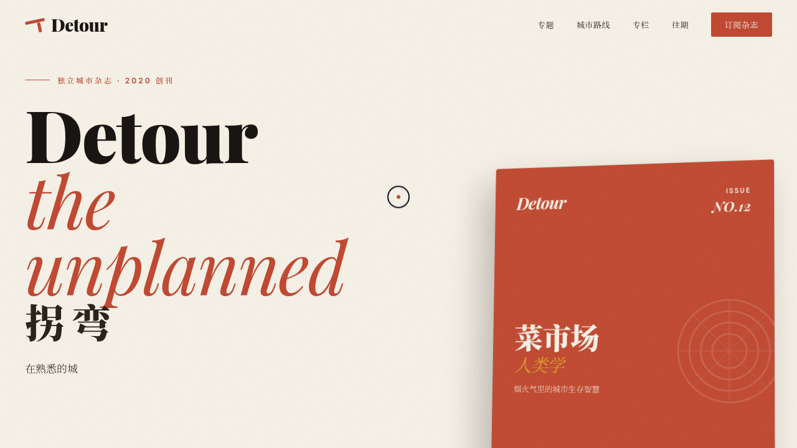

# 拐弯 Detour · 城市漫游独立杂志

- **日期**：2026-08-17
- **方向**：V1 网页设计
- **主题**：城市漫游独立纸刊的官方网站——围绕菜市场人类学、深夜面馆地图、老城修表匠、天桥下的滑板场等真实专题展开
- **配色**：砖红 `#C14A33` + 奶油 `#F6F1E7` + 墨黑 `#191512` + 芥末黄 `#D9A62E` + 灰绿 `#6E7F6A`（无蓝紫渐变）

## 简介

一本关注城市街巷、社区人物与在地文化的独立杂志的官网单页。从 Hero 杂志封面、精选专题、封面故事跨栏、城市漫游路线、专栏作者、往期目录到订阅区，内容真实可信、版式编辑化。所有按钮 / 卡片 / Tab / 订阅表单均可交互。

## 截图

## 动效亮点

13 个组件级特效：自定义光标（弹簧跟随+点击涟漪）、打字机循环标语、数字计数、滚动渐入、3D 卡片倾斜、磁性按钮、封面贴纸浮动、头像脉冲光晕、导航栏滚动收缩、Tab 切换、扫光提示、粒子爆炸、光泽扫过。

## 在线预览
- 妙搭应用：https://dcniaqwtmoca.feishu.cn/page/CHcPmCuKAdhO1Ia17afcmO2GnVK

## 文件说明
| 文件 | 说明 |
|------|------|
| index.html | 完整可运行源码（JSX/CSS 全内联单文件） |
| 设计规范.md | 色彩系统、字体、组件规范、动效系统、页面结构 |
| preview.png / thumbnail.png | 杂志官网界面截图 |

## 技术栈
React 18 + Babel standalone（全内联）、CSS3 动画、自定义光标系统、prefers-reduced-motion 降级。
