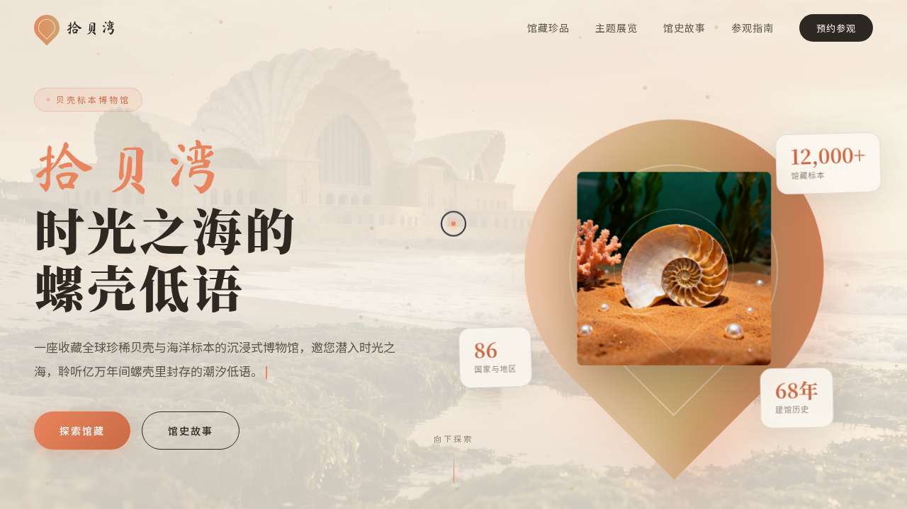

# 拾贝湾 · 贝壳标本博物馆

> V1 网页设计 · 2026-08-17 · 单页沉浸式博物馆官网

## 主题

一座虚拟的贝壳 / 海洋标本博物馆「拾贝湾」的沉浸式官网：馆藏珍品、主题展览、馆史故事、参观指南，围绕贝壳标本组织真实可信的内容。

## 设计说明

暖沙金 + 珊瑚橘 + 珍珠白 + 深海藻绿的海岸色系；手写体大标题（Ma Shan Zheng）搭配衬线副标，营造人文馆藏气质。

## 动效亮点

- 自定义光标：白色粗环 + 珊瑚内点 + 多层发光，悬停变形、点击涟漪，开页即居中显示
- Hero 鹦鹉螺 3D 鼠标倾斜（弹簧阻尼插值）+ 金砂粒子漂浮
- 卡片悬停跟随鼠标的径向发光 + 3D tilt
- 打字机副标题、数字滚动计数、滚动渐入、FAQ 手风琴、按钮光泽扫过等 14 项组件级特效

## 在线预览

https://dcniaqwtmoca.feishu.cn/page/NJhgmLBqAdsL17am3SPcAZsJndg

## 文件说明

| 文件 | 说明 |
|---|---|
| index.html | 完整可运行源码（JSX 全部内联），浏览器直接打开可预览 |
| 设计规范.md | 色彩 / 字体 / 页面结构 / 动效系统 |
| thumbnail.png | 页面真实截图 |

## 技术栈

React（Babel standalone 内联 JSX）+ 原生 CSS 动效 + RAF 物理插值
