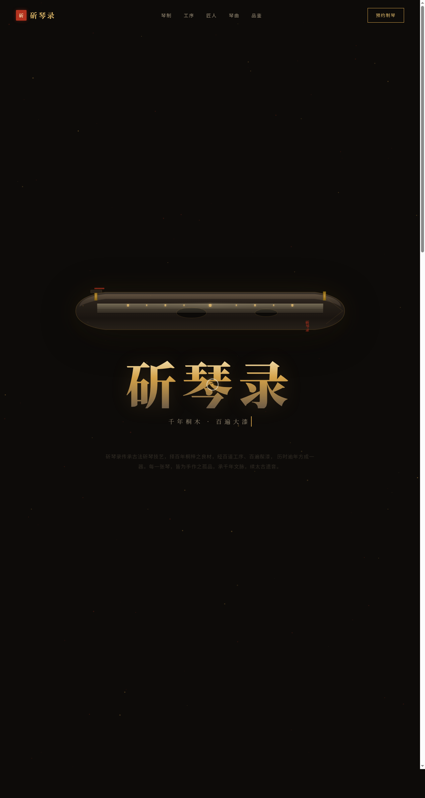

# 斫琴录 · 古琴工坊

> 日期：2026-08-17 · 方向：V1 网页设计 · 主题：古琴斫制工坊官网

## 简介

一家传承古琴斫制技艺的工坊艺术品级单页官网。以大漆玄黑为底、朱砂红点睛、金箔提亮、桐木暖黄温润，营造东方器物美学。纯 SVG 绘制伏羲式古琴作为 Hero，围绕琴制式、斫琴工序、琴曲琴谱、匠人、预约品鉴组织真实内容。

## 截图

## 动效亮点

自定义光标（阻尼外环 + 悬停三态）、金箔微粒上浮、琴弦振动、打字机、卡片 3D 倾斜 + 光泽扫过、印章脉冲、声波频谱柱、滚动渐入、数字计数、金箔噪点呼吸，共 13 个组件级特效。

## 妙搭在线预览

https://dcniaqwtmoca.feishu.cn/page/INEvmgAc0d7Qu6aIgG5cq2Bvno0

## 文件说明

| 文件 | 说明 |
|---|---|
| index.html | 完整可运行源码（HTML + 内联 CSS/JS） |
| preview.png | 页面截图 |
| 设计规范.md | 色彩 / 字体 / 组件 / 动效规范 |
| thumbnail.png | 平台自带缩略图 |

## 技术栈

纯原生 HTML + CSS + JavaScript（无框架），单文件内联实现。
