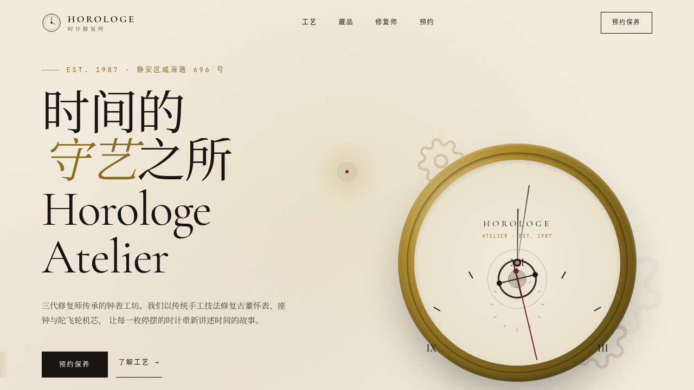

# 时计修复所 HOROLOGE

- **日期**：2026-08-17
- **方向**：V1 网页设计
- **主题**：古董钟表修复工坊品牌官网——围绕怀表/座钟修复工艺、修复师传承、馆藏时计、预约保养组织真实内容。
- **配色**：象牙白 `#F2EBDD` 主底 + 墨黑 `#171512` + 黄铜金 `#B08D2E` + 勃艮第酒红 `#7A1E2B` 点缀（无蓝紫渐变）

## 简介
一件艺术品级单页品牌官网 mock。Hero 为实时走时怀表（时/分/秒针跟随系统时间、秒针连续扫秒、摆轮往复、齿轮视差），向下串联工艺理念、修复师、流程时间轴、馆藏表款网格、预约表单与跑马灯页脚。所有按钮/卡片/表单均可交互。

## 截图

## 动效亮点
16 个组件级特效：自定义光标（白环+酒红内点+黄铜光晕，点击涟漪）、实时走时怀表指针、摆轮 2.5s 振荡+游丝呼吸、三齿轮视差、表壳 3D 倾斜（lerp 阻尼）、数字计数（easeOutCubic+IntersectionObserver）、滚动渐入阶梯、磁吸按钮（反平方引力）、卡片 3D 倾斜+径向高光、标题逐行 slideUp、导航弹簧下划线+毛玻璃、按钮光斑扫过、跑马灯、表单聚焦下划线展开、提交 spring 弹出、顶部滚动进度条。

## 在线预览
- 妙搭应用：https://dcniaqwtmoca.feishu.cn/page/EyR6mcSThd6gnPaXkSTc7F0KnEd

## 文件说明
| 文件 | 说明 |
|------|------|
| index.html | 完整可运行源码（JSX/CSS 全内联单文件） |
| 设计规范.md | 色彩系统、字体、组件、动效、页面结构 |
| preview.png / thumbnail.png | 页面截图 |

## 技术栈
React 18 + Babel standalone（全内联）、CSS3 动画、自定义光标系统、prefers-reduced-motion 降级。
