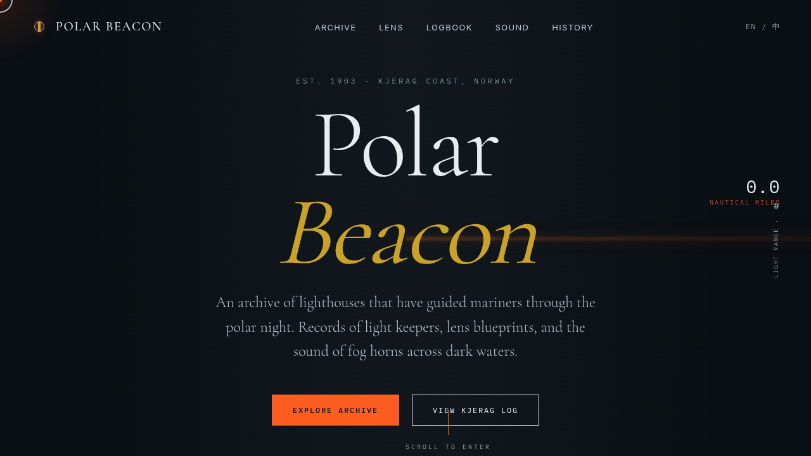

# 极夜灯塔 Polar Beacon · 网页设计

- 日期：2026-08-17
- 方向：V1 网页设计
- 主题：极夜灯塔 Polar Beacon —— 北欧灯塔档案馆官方网站
- 配色：深夜墨黑 #0A0F14 / 雾白 #E8EDF2 / 信号橙 #FF5C1F / 冰川青灰 #8FB3BC / 旧铜金 #C9A227（禁蓝紫渐变）

## 简介

一座虚构但内容真实的北欧灯塔档案馆官网。围绕灯塔 / 极夜 / 海事档案组织内容：精选灯塔档案（Kjerag 守望灯等）、菲涅尔透镜剖面图解、守灯人日志节选、雾笛声纹波形、历史纪年时间线。围绕灯塔主题构建动效：旋转灯束扫过、雾笛声波涟漪、滚动驱动透镜折射光带、守灯人日志打字机。

## 截图

## 动效亮点

- 灯塔旋转灯束（角度积分、双速双束）
- 菲涅尔透镜折射光带（滚动驱动旋转 + 呼吸透明度）
- 雾笛波形频谱（基频+泛音+颤音数学模型，可播放/暂停/跳转）
- 守灯人日志打字机（随机可变节拍）
- 光程计数器（弹簧物理 + 阻尼）
- 磁性按钮（反平方引力）
- 自定义光标三环 + 点击涟漪
共 15 项组件级动效，均基于物理/主题语义。

## 妙搭在线预览

https://dcniaqwtmoca.feishu.cn/page/TYfUmTnyedy0egarYjLcsQuSnJf

## 文件说明

| 文件 | 说明 |
|---|---|
| index.html | 完整可运行源码（HTML/CSS/JS 全内联单文件） |
| preview.png | 页面截图 |
| thumbnail.png | 缩略图 |
| 设计规范.md | 色彩 / 字体 / 组件 / 动效规范 |

## 技术栈

纯 HTML + CSS + 原生 JS（vanilla），无框架、无外部 CDN 依赖。
