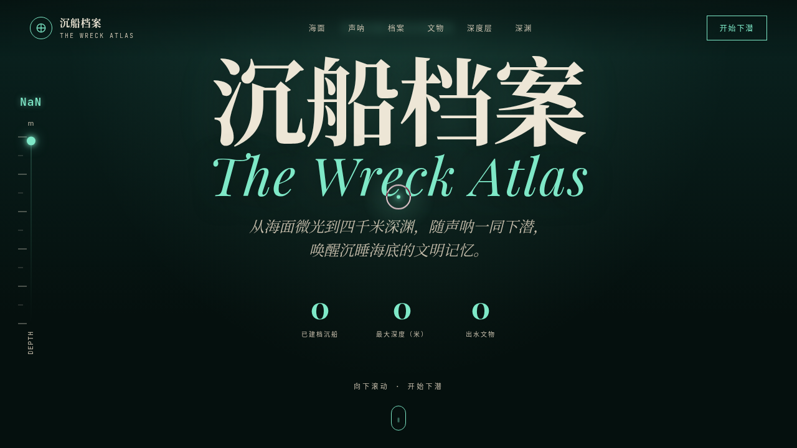

# 沉船档案 The Wreck Atlas · V1 网页设计 Mock

> 日期：2026-08-17 ｜ 方向：V1 网页设计 ｜ 主题：深海沉船沉浸式档案馆

## 简介

一座以「下潜」为核心叙事的深海沉船档案馆网站。页面滚动即下潜——从海面微光 0 米一路潜入 4000 米深渊，沿途经过声呐扫描、四艘著名沉船档案（泰坦尼克号、俾斯麦号、圣何塞号、南海一号）、打捞文物档案卡、声纹频谱与深度层剖面。配色取深海墨黑、海藻绿、磷光青与沉铜金，冷硬锐利。

## 截图

## 动效亮点

- 自定义光标：白环 + 磷光青内点 + 发光拖影，悬停形变、点击涟漪
- 深度计随滚动从 0m 推进至 4000m，easeOutExpo 计数
- 声呐旋转扫描 + 海洋雪粒子（RAF 积分器摆动下落）
- 文物卡 3D 鼠标跟随倾斜 + 光泽扫过
- 32 根声波柱多正弦合成频谱振动
- 打字机标题、时间线节点涟漪、光柱摇曳（共 14 项组件级动效）

## 妙搭在线预览

https://dcniaqwtmoca.feishu.cn/page/CIIDmqjBAdWKcja3ZlEc2RvXnEe

## 文件说明

| 文件 | 说明 |
|---|---|
| index.html | 完整可运行源码（纯 vanilla 单文件，含内联 CSS/JS） |
| preview.png | 页面截图 |
| 设计规范.md | 色彩系统、字体、组件、动效规范 |

## 技术栈

纯 vanilla HTML/CSS/JS 单文件，零外部依赖，零 React/Babel；支持 prefers-reduced-motion。
