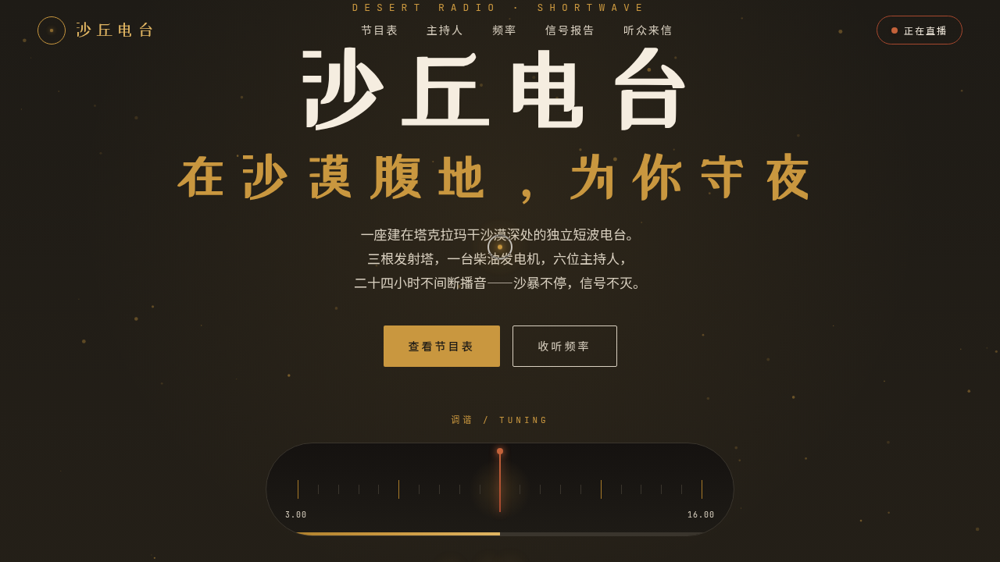

# 沙丘电台 Desert Radio · 网页设计

> 日期：2026-08-17 · 方向：V1 网页设计 · 主题：沙漠腹地短波电台主题官网

## 简介

「沙丘电台」是一座虚构于沙漠腹地的短波广播电台官网。Hero 区以模拟调谐表盘开场，指针阻尼摆动、频率浮动；节目表分晨间 / 午后 / 深夜三档，9 个节目卡片含直播标签与频率芯片；主持人四张 3D 倾斜卡片跟随鼠标；全波段频率区频谱跳动；信号报告区实时波形 + 沙暴天气实况；底部听众来信。整体墨黑底 + 沙漠金 + 赭红的暖色基调，贴合夜间电台氛围。

## 动效亮点

- 模拟调谐表盘（指针阻尼摆动 + 频率数字浮动）
- 沙粒粒子 Canvas 漂移
- 信号频谱柱状跳动（各柱周期不同）
- 实时信号波形 SVG 多正弦叠加
- 主持人卡片 3D 倾斜（弹簧物理）
- 打字机呼号 + 数字滚动计数 + 滚动渐入
- 自定义光标：白环 + 沙金内点，悬停放大变色，点击涟漪，开页居中

## 妙搭在线预览

https://dcniaqwtmoca.feishu.cn/page/W9nZmHxVAdKlw0aug5rc02Qvnvc

## 文件说明

| 文件 | 说明 |
|---|---|
| index.html | 完整可运行源码（单文件，内联 CSS/JS） |
| thumbnail.png | 页面截图 |
| 设计规范.md | 色彩 / 字体 / 组件 / 动效规范 |

## 技术栈

纯 vanilla HTML/CSS/JS 单文件，Canvas + SVG 动画，无外部 CDN 依赖。
