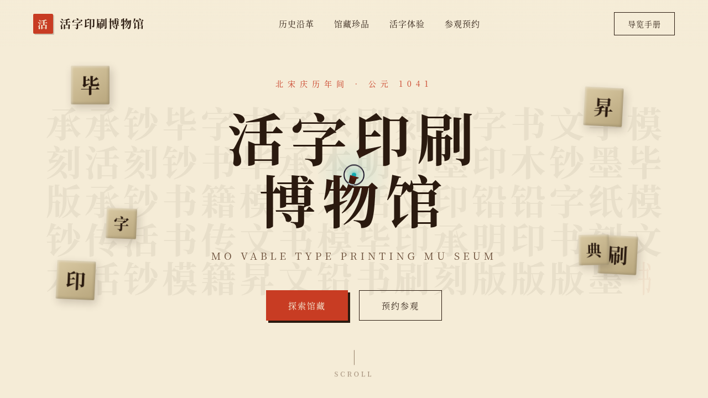

# 活字印坊 Movable Type Museum · V1 网页设计

## 基本信息

- **日期**：2026-08-17
- **方向**：V1 网页设计
- **主题**：活字印刷博物馆官网
- **配色**：宣纸米黄 + 墨色深棕 + 朱砂印红 + 青铜鎏金（古典书卷气，无蓝紫渐变）

## 简介

围绕毕昇泥活字、木活字转轮、铜活字、武英殿聚珍版等核心藏品叙事的活字印刷博物馆官网。以宣纸质感为底，宋体衬线为骨，朱砂印章为魂，呈现东方印刷术千年演进。

## 截图

## 动效亮点

- 自定义光标：弹簧阻尼追随 + 多层发光 + 墨晕扩散
- Hero 活字阵：随机翻字 rotateY 翻转 + 鼠标视差深度位移
- 活字矩阵磁场斥力：反平方距离模型驱动方块避让
- 打字机典籍摘钞：变速度 + 标点停顿 + 循环重置
- 数字计数 easeOutExpo 缓动 + 3D 倾斜卡片 + 光泽扫过

## 文件说明

| 文件 | 说明 |
|------|------|
| `index.html` | 完整源码（纯 vanilla HTML/CSS/JS 单文件） |
| `preview.png` | 页面截图（1280×2400） |
| `thumbnail.png` | 缩略图（1280×720） |
| `设计规范.md` | 设计规范文档 |

## 在线预览

[妙搭在线预览](https://dcniaqwtmoca.feishu.cn/page/QJ94mPAiBdx7sfaTyY3cJWXhndf)

## 技术栈

纯 vanilla HTML/CSS/JS 单文件实现，零外部依赖，零 React/Babel。
