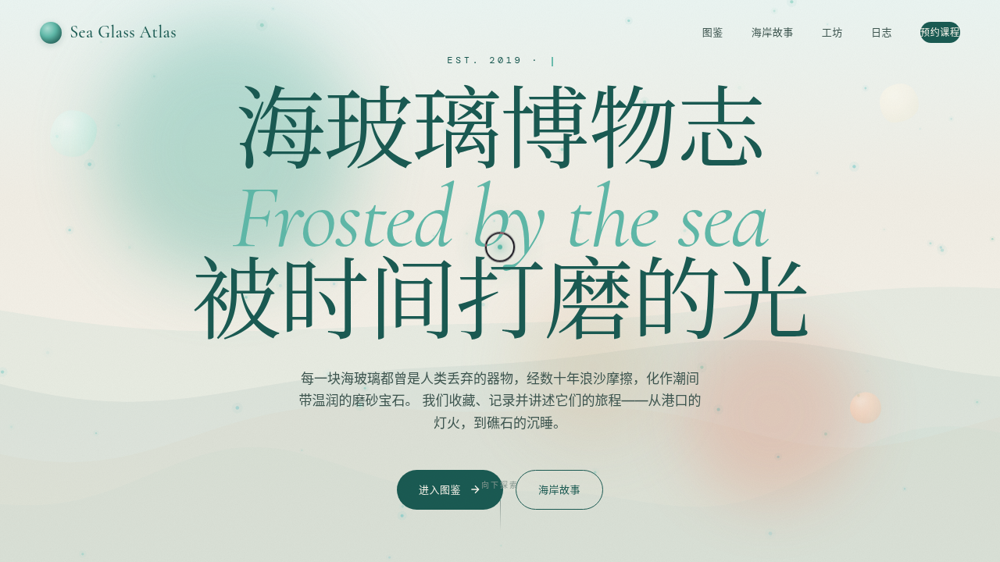

# 海玻璃博物馆 Sea Glass Atlas

> 日期：2026-08-17 ｜ 方向：V1 网页设计 ｜ 主题：海玻璃收集与海岸艺术品牌官网

## 简介

一件艺术品级的单页品牌官网。海玻璃是被丢弃的玻璃经海水浪沙打磨成磨砂宝石的自然产物——博物馆兼具收藏图鉴、海岸故事、手工工坊预约。配色取潮间带质感：海泡绿、珊瑚橙、沙金黄、奶油白。

## 截图

## 动效亮点

自定义光标（弹簧跟随+三态切换+涟漪）、潮汐粒子画布（多正弦波叠加）、3D 卡片倾斜、磨砂光箱、滚动视差、磁吸按钮（反平方引力）、数字计数、打字机、光泽扫过、脉动光环——共 16 项组件级特效，基于弹簧/正弦/ease-out 物理模型。

## 在线预览

https://dcniaqwtmoca.feishu.cn/page/VBOBmpyfndy94zaN1tscW0uDnCg

## 文件说明

| 文件 | 说明 |
|---|---|
| index.html | 完整可运行单文件源码 |
| 设计规范.md | 色彩/字体/组件/动效/页面结构 |
| thumbnail.png | 页面截图预览 |
| README.md | 本说明 |

## 技术栈

纯 HTML/CSS/JS 单文件，无框架依赖（仅字体 CDN）。
