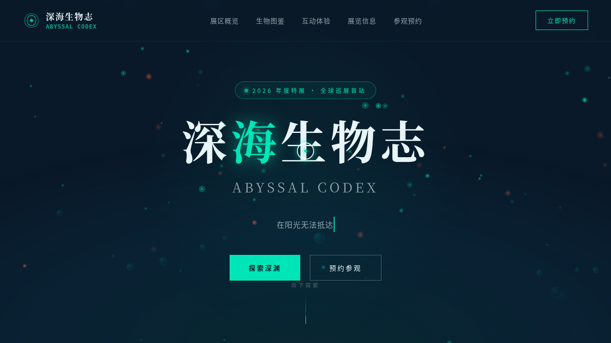

# 深海生物志 Abyssal Codex · 深海生物特展官网

> 日期：2026-08-17 · 方向：V1 网页设计 · 主题：深海生物展览官网

## 简介

一个深海生物特展的完整官网，围绕鮟鱇鱼、巨型乌贼、管虫、水熊虫等真实深海生物组织内容。深渊墨蓝黑主调搭配生物荧光青绿与珊瑚橙红，营造深海氛围。包含首屏 Hero、四大展区、生物图鉴、声谱可视化互动、深度模拟器、展览信息与预约表单。

## 截图

## 动效亮点

- 自定义光标：白色粗环 + 荧光青绿内点 + 双层发光，悬停放大变色，点击涟漪
- 深海粒子背景：脉动发光粒子 + 上浮气泡 + 鼠标跟随光斑
- 打字机 slogan：打字 + 回删循环
- 3D 卡片倾斜：惯性阻尼 + 鼠标映射
- 声谱可视化：多频率正弦叠加 + 呼吸待机模式
- 深度模拟器：拖动潜水器 + 弹簧缓动
- 数字计数动画：easeOutExpo 缓动
- 滚动渐入：上/左/右三向 + 阶梯延迟

## 文件说明

| 文件 | 说明 |
|------|------|
| `index.html` | 完整源码（纯 vanilla HTML/CSS/JS 单文件） |
| `设计规范.md` | 色彩系统、字体、组件、动效规范 |
| `preview.png` | 页面截图 |
| `thumbnail.png` | 缩略图 |

## 妙搭在线预览

https://dcniaqwtmoca.feishu.cn/page/OrLYm3XvpdpPCvaWh2scpZdTnue

## 技术栈

- 纯 vanilla HTML/CSS/JS，无 React/Babel/CDN 依赖
- RAF 积分器驱动物理动画
- visibilitychange 自动暂停 + beforeunload 清理
- prefers-reduced-motion 完整降级
