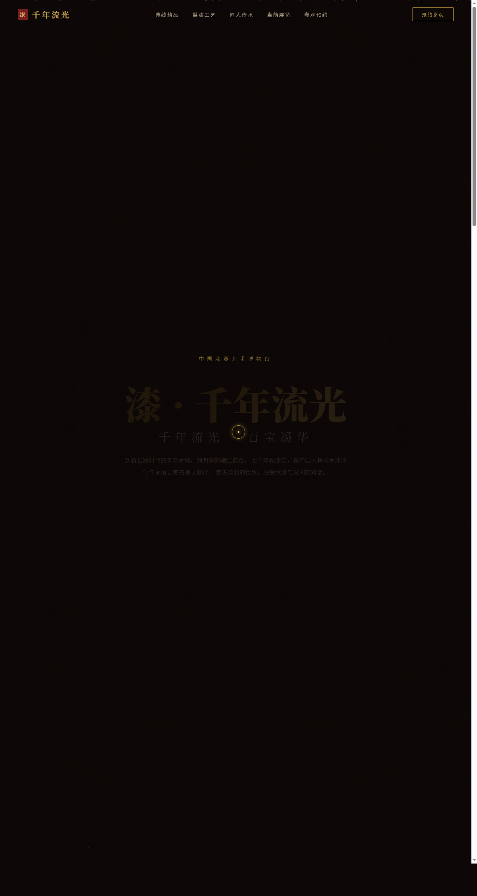

# 漆 · 千年流光 Lacquerware Art Museum

> 日期：2026-08-17 · 方向：V1 网页设计 · 主题：中国漆器艺术展交互网页

## 简介

「漆 · 千年流光」是一座以中国漆器艺术为主题的线上美术馆。页面以髹漆黑为底、描金为饰，模拟推光漆面的深邃光泽。包含典藏精品、髹漆工艺、匠人传承、当前展览、艺术长廊、参观预约七大区块，每个区块都有独特的布局结构和滚动驱动的动效。

## 截图

## 动效亮点

- 自定义漆液涟漪光标 — 白色粗环+金色内点+多层发光，开页即显示在屏幕中央
- 金箔漂浮粒子 — Canvas 粒子系统，金箔碎片在页面中缓慢飘落
- 3D 藏品卡倾斜 — 鼠标悬停时卡片跟随鼠标位置 3D 倾斜
- 金色流光标题 — CSS 渐变动画，金色光泽从左到右流过标题文字
- 数字计数动画 — 滚动入视时传承人数据从 0 计数到目标值
- 灯箱画廊 — 点击作品图片放大查看，背景遮罩淡入
- 滚动渐入 — 各区块内容滚动入视时渐入显示

## 文件说明

| 文件 | 说明 |
|------|------|
| index.html | 完整可运行的源代码（含内联 CSS/JS） |
| preview.png | 页面截图 |
| 设计规范.md | 设计规范文档 |
| README.md | 本文件 |

## 在线预览

[漆 · 千年流光](https://dcniaqwtmoca.feishu.cn/page/RC0amr8wLdiVIVaA4uhcOOa1nRg)

## 技术栈

纯 HTML/CSS/JS 单文件实现，无 React / 无 Babel / 无外部 CDN 依赖。Canvas 粒子系统、IntersectionObserver 滚动渐入、RAF 数字计数、visibilitychange 自动暂停、prefers-reduced-motion 降级。
