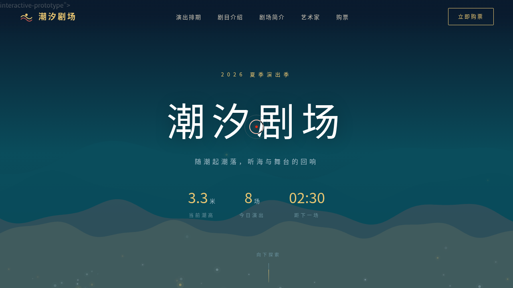

# 潮汐剧场 Tidal Theater · 海岸露天剧场官网

> 日期：2026-08-17 · 方向：V1 网页设计 · 主题：海岸露天剧场，演出时刻随潮汐编排

## 简介

潮汐剧场是一座虚构的海岸露天剧场，演出时刻表随潮汐涨落时间编排——高潮时奏乐，低潮时吟诵，涨潮时起舞。网站以沉浸式海浪动画开场，通过潮汐时间线串联演出排期，呈现剧场与自然节律的共生关系。

## 截图

## 动效亮点

- **多层海浪 Canvas**：4 层正弦+高次谐波叠加，不同频率/振幅/速度
- **自定义光标**：白环+珊瑚红内点+多层发光，弹簧跟随，悬停三态切换
- **潮汐时间线 SVG**：波浪曲线描边动画 + 高低潮脉冲标记点
- **卡片 3D 磁悬浮**：弹簧阻尼物理模型，鼠标驱动倾斜
- **光泽扫过**：skew 斜向光带掠过卡片
- **标题逐字入场**：错峰延迟上浮
- **数字计数**：easeOutCubic 缓动
- **Hero 视差滚动**：内容/背景不同速率

## 文件说明

| 文件 | 说明 |
|------|------|
| index.html | 完整可运行源码（纯 vanilla HTML/CSS/JS） |
| preview.png | 页面截图 |
| 设计规范.md | 色彩系统、字体、组件、动效规范 |
| README.md | 本文件 |

## 妙搭在线预览

https://dcniaqwtmoca.feishu.cn/page/SLcgmHaOXdrN54adS06cmP6Ynhc

## 技术栈

纯 vanilla HTML/CSS/JS 单文件，零外部 CDN 依赖。Canvas 2D 渲染海浪与粒子，SVG 路径动画，IntersectionObserver 滚动监听，visibilitychange 暂停 / prefers-reduced-motion 降级。
