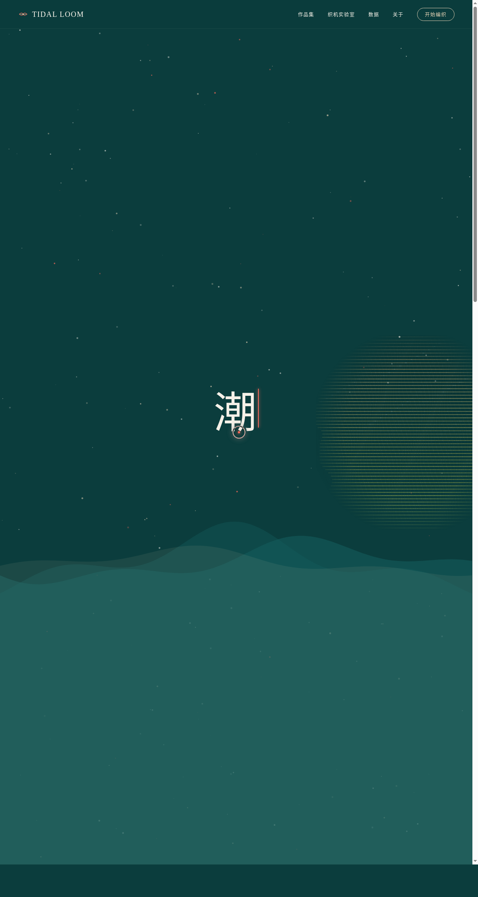

# 潮汐织机 Tidal Loom · 生成式编织艺术官网

> 方向：V1 网页设计 · 日期：2026-08-17 · 主题：潮汐数据驱动的生成式编织艺术

## 简介

潮汐织机是一个由全球港口潮汐数据驱动的生成式编织艺术官网。网站将潮汐波形"织"成视觉图案——每个港口的潮汐涨落对应一组纬线密度与振幅参数，最终在 Canvas 上交织成独特的编织纹理。

## 截图

## 配色

深青绿 `#0B3D3D` + 珊瑚橙 `#FF6B5B` + 沙金 `#E8D5B7` + 泡沫白 `#F5F1E8`，禁止蓝紫渐变。

## 动效亮点

- 互动织机实验室：4 个参数滑块实时重绘 Canvas 编织图案，点击产生涟漪扩散，可切换 4 个港口数据源
- 自定义光标：白色粗环 + 珊瑚橙内点 + 多层发光，悬停可交互元素放大变色
- 潮汐粒子背景随波浪起伏，Hero 标题打字机效果，作品卡片 3D 倾斜 + 光泽扫过，数字滚动计数

## 在线预览

https://dcniaqwtmoca.feishu.cn/page/GaDLmM24MdyoaTa3HBMc2uCInMg

## 文件说明

| 文件 | 说明 |
|------|------|
| index.html | 完整可运行源码（纯 vanilla 单文件） |
| preview.png | 页面截图 |
| 设计规范.md | 色彩/字体/组件/动效规范 |

## 技术栈

纯 HTML/CSS/JavaScript，无 React/Babel/CDN 依赖。
