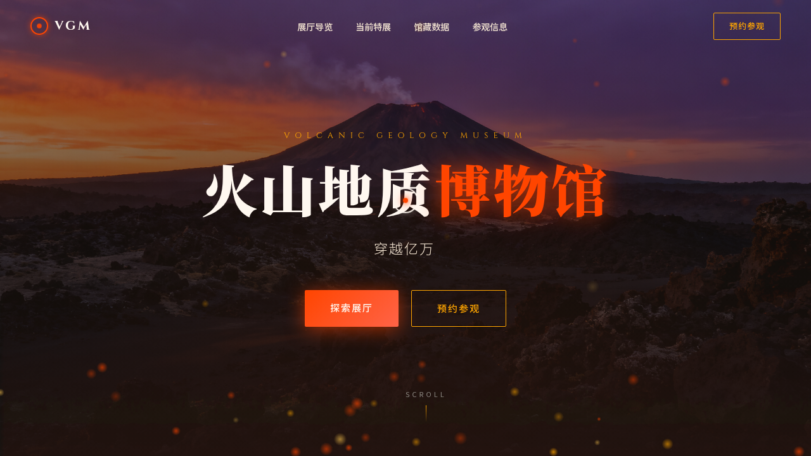

# 火山地质博物馆 Volcanic Geology Museum

**日期**：2026-08-17
**方向**：V1 网页设计
**主题**：火山地质博物馆官方网站

## 简介

一个虚构的火山地质博物馆官方网站，展示火山形成原理、岩浆类型、地质年代、火山口实景等内容。采用黑曜石黑 + 岩浆橙红 + 琥珀金的配色方案，营造炽热地质氛围。

## 截图

## 动效亮点

- 自定义光标：白色粗环 + 岩浆橙内点 + 多层发光，悬停放大变色
- 岩浆流粒子背景：Canvas 物理粒子上升 + 水平摆动
- 滚动视差：Hero 区和特展区多层不同速度移动
- 展厅卡片 3D 倾斜：鼠标驱动直接操作 DOM
- 数字计数动画：easeOutCubic 缓动
- 热浪扭曲：SVG feTurbulence + feDisplacementMap 滤镜
- 打字机效果：3 句标语循环
- 光泽扫过：卡片表面伪元素动画

## 文件说明

| 文件 | 说明 |
|------|------|
| index.html | 完整可运行的网页源码（含内联 CSS/JS） |
| preview.png | 页面截图 |
| 设计规范.md | 设计规范文档 |

## 在线预览

[火山地质博物馆](https://dcniaqwtmoca.feishu.cn/page/CWTrm6VhqdyRYqameqOckKyFnsd)

## 技术栈

- 纯 HTML / CSS / JavaScript（无框架依赖）
- Canvas API（粒子系统）
- SVG 滤镜（热浪效果）
- IntersectionObserver（滚动渐入）
- CSS Animation / Transition
