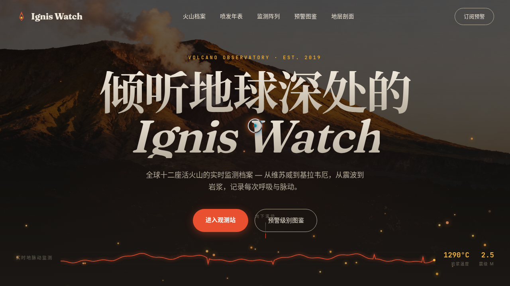

# 火山观测志 Ignis Watch

- 日期：2026-08-17
- 方向：V1 网页设计
- 主题：火山地质观测站主题的单页艺术网站

## 简介

围绕真实火山与地质观测展开的单页艺术网站：火山档案（维苏威 / 埃特纳 / 基拉韦厄 / 圣海伦斯）、喷发年表、监测仪器阵列、预警级别图鉴、火山灰样本馆、地层剖面视差。内容考据可信，非占位文本。

## 截图

## 动效亮点

自定义光标（白环+熔岩色内点+发光）、地热粒子上升、实时地震波形 Canvas 描线、岩浆温度数字滚动、打字机、3D 卡片倾斜、地层视差滚动、熔岩流动分隔带、状态脉冲 LED、光泽扫过、跑马灯等 15+ 组件级特效，全部基于物理模型 / 主题语义。

## 妙搭在线预览

https://dcniaqwtmoca.feishu.cn/page/TUHlmtEgZd7QpXapaAWcnftUn0e

## 文件说明

| 文件 | 说明 |
|------|------|
| index.html | 完整可运行源码（HTML + 内联 CSS/JS） |
| 设计规范.md | 色彩系统 / 字体 / 组件 / 动效 / 页面结构 |
| thumbnail.png | 页面截图 |

## 技术栈

纯 HTML + 内联 CSS + 原生 JS（Canvas / RAF / IntersectionObserver），无构建依赖。配色：玄武岩黑 / 熔岩橙红 / 硫磺金 / 火山灰米白。
