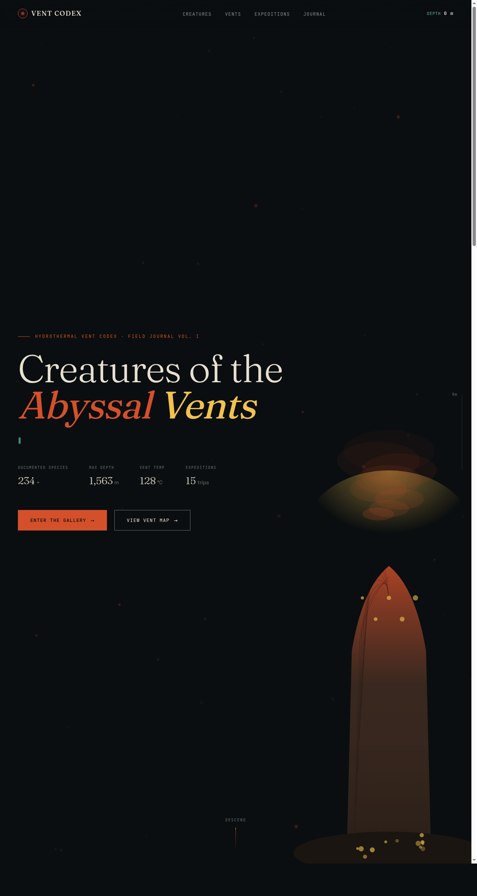

# 热泉口生物图鉴 (Hydrothermal Vent Codex)

日期：2026-08-17 · 方向：V1 网页设计 · 主题：深海热泉口生态系统生物田野图鉴

## 简介

一份真实可交互的完整网站，呈现深海热泉口（hydrothermal vent）生态系统的生物田野图鉴。从潜水器下潜视角出发，收录管蠕虫、雪人蟹、热泉虾等标志性物种，配以全球热泉口分布地图与科考日志时间线。

## 配色

深炭黑底 #0A0E10 + 赤铜橙主色 #D4502A + 硫磺黄强调 #F2C14E + 冷青绿辅色 #3A8E7C。深海冷底与热泉暖光形成强对比。

## 截图

## 动效亮点

- 打字机终端循环模拟潜水器通讯
- 上升气泡 + 下沉热粒子双 canvas 系统
- 自定义光标（白环 + 铜色内点 + 多层发光 + 点击涟漪）
- 卡片 3D 倾斜、生物发光脉冲、地图热泉口脉冲扩散
- 右侧深度条随滚动填充，顶部导航实时深度数值

## 文件说明

| 文件 | 说明 |
|------|------|
| index.html | 完整可运行源码（单文件） |
| preview.png | 页面截图 |
| 设计规范.md | 色彩/字体/组件/动效规范 |

## 在线预览

https://dcniaqwtmoca.feishu.cn/page/PXTumvjpwd9UkJa2nUEcRUsyn4b

## 技术栈

纯 HTML/CSS/JS 单文件，无 React/Babel/CDN 依赖。
