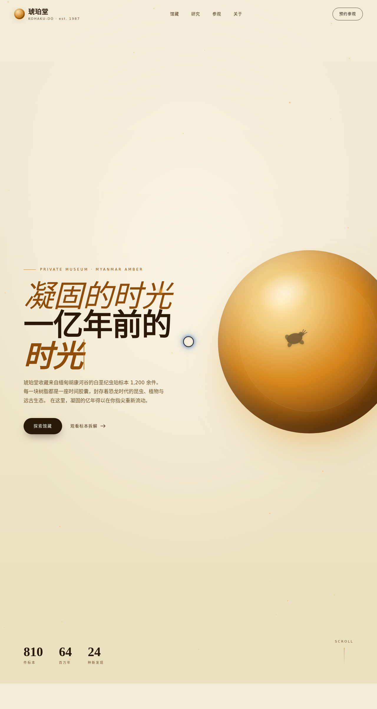

# 琥珀堂 Kohaku-Do

> 日期：2026-08-17 · 方向：V1 网页设计 · 主题：缅甸白垩纪虫珀私人博物馆

一个真实可交互的单页网站，以白垩纪虫珀私人博物馆为主题，暖琥珀金 + 骨白配色，14 个基于物理模型的组件级动效。

## 动效亮点

- 自定义三环光标（弹簧阻尼 + 惯性环），开页即居中显示，悬停放大变色、点击涟漪
- Hero 琥珀球 3D 视差（弹簧平滑）+ 32 颗尘埃粒子正弦漂浮
- 磁性按钮（反平方引力 pull，13 处）
- 标本卡片 3D 倾斜（perspective + 弹簧回归）
- 放大镜 loupe（hover 镇馆之宝局部放大虫珀细节）
- 打字机标题 / 数字计数器 / 滚动渐入 / 视差引言 / 光泽扫过

## 文件说明

| 文件 | 说明 |
|------|------|
| index.html | 完整可运行源码（纯 vanilla 单文件） |
| 设计规范.md | 色彩 / 字体 / 组件 / 动效系统 |
| preview.png | 页面截图 |
| thumbnail.png | 缩略图 |

## 妙搭在线预览

https://dcniaqwtmoca.feishu.cn/page/Ylxomy42Fd0RnDaRmjtcw61UnCd

## 技术栈

纯 vanilla HTML / CSS / JavaScript 单文件，无 React / Babel / CDN 依赖。
