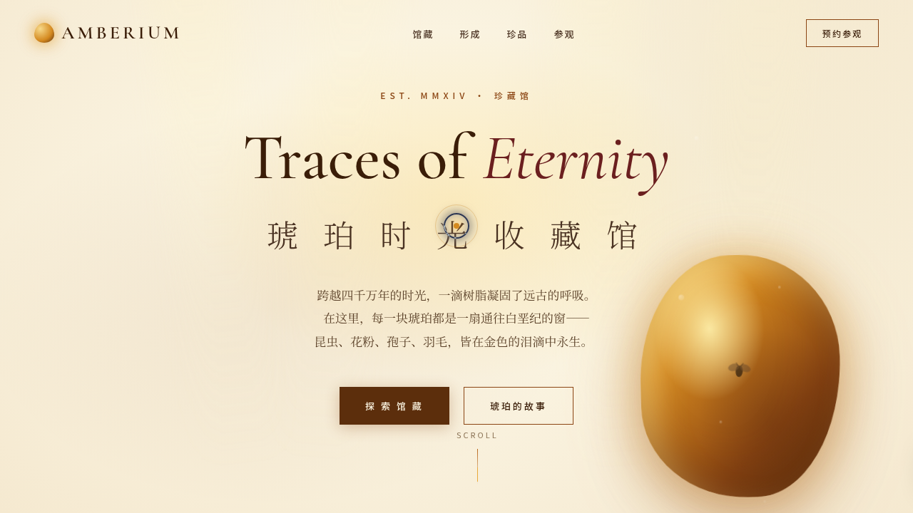

# 琥珀时光收藏馆 Amberium

> 日期：2026-08-17 ｜ 方向：V1 网页设计 ｜ 主题：琥珀（古生物树脂化石）收藏馆品牌站

## 简介

一座单页滚动式的琥珀收藏馆官网：从悬浮琥珀英雄区、馆藏数据、标本陈列矩阵、镇馆之宝 3D 翻转，到琥珀形成时间线与跑马灯尾页。温润琥珀金 + 干邑棕 + 羊皮纸米 + 酒红点缀的金色系，纯 vanilla 单文件实现，全站真实可交互。

## 截图

## 动效亮点

16 项组件级特效：自定义光标（惯性跟随/悬停放大/点击涟漪）、尘埃粒子、英雄区鼠标视差（弹簧阻尼）、滚动渐入、数字计数、标本卡片 3D 倾斜、光泽扫过、树脂滴落时间线、声波频谱条、镇馆之宝 3D 翻转、光线摇曳、气泡上升、打字机光标、跑马灯、筛选交错淡入淡出、时间线滚动激活。

## 文件说明

| 文件 | 说明 |
|---|---|
| `index.html` | 完整单文件源码（HTML+CSS+JS 内联），浏览器直接打开可预览 |
| `设计规范.md` | 色彩系统（含色值）、字体、组件、动效、页面结构 |
| `preview.png` / `thumbnail.png` | 页面截图 |

## 在线预览

https://dcniaqwtmoca.feishu.cn/page/H7ffmxkefdiKyFauoVyc9zvGngx

## 技术栈

纯 vanilla HTML/CSS/JS 单文件（无 React / 无 Babel / 无外部依赖）。
