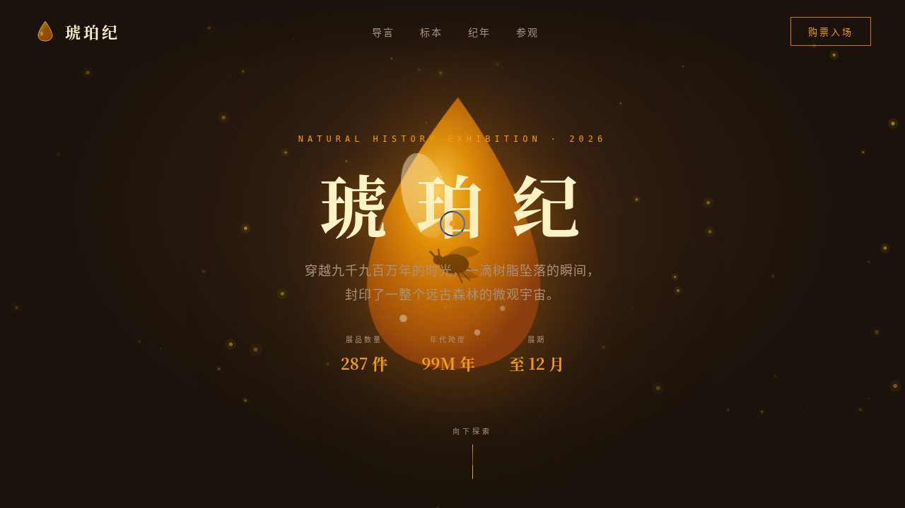

# 琥珀纪 Amber Chronicle · 远古树脂中的时空胶囊

> 日期：2026-08-17 · 方向：V1 网页设计 · 主题：琥珀化石自然特展沉浸式官网

## 简介

一座幽暗展柜中悬浮着金色树脂的虚拟自然博物馆特展。围绕琥珀化石主题组织标本画廊、地质时间线与参观信息，以琥珀滴漂浮、粒子光点与 3D 倾斜卡片营造封存远古生命的时空感。

## 设计说明

- 配色：深赭石底 + 琥珀金 + 松绿点缀 + 象牙白带 + 焦橙强调（禁蓝紫渐变）
- 字体：思源宋体（展示）/ 思源黑体（正文）/ JetBrains Mono（数据）
- 单页纵向叙事，纯 vanilla 实现，零外部依赖

## 截图

## 动效亮点

自定义光标三层跟随、80 颗琥珀粒子呼吸上浮、琥珀滴双正弦漂浮、标题逐一升起、打字机导言、数字计数、标本卡片 3D 倾斜弹簧阻尼、光泽扫过、滚动渐入、时间线交错脉冲、视差滚动、磁性按钮反平方引力。

## 妙搭在线预览

https://dcniaqwtmoca.feishu.cn/page/PjVdmrcmFdbCM6a9QwAc62pXnEe

## 文件说明

| 文件 | 说明 |
|------|------|
| index.html | 完整可运行源码（单文件，含 CSS/JS） |
| 设计规范.md | 色彩系统、字体、组件、动效、页面结构 |
| preview.png | 页面截图 |
| thumbnail.png | 缩略图 |

## 技术栈

纯 vanilla HTML/CSS/JS 单文件，无 React/Babel/CDN 依赖。
