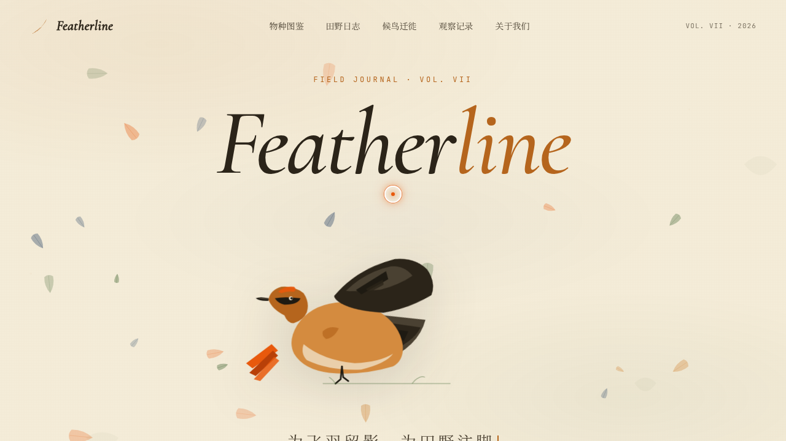

# Featherline 田野图鉴 — 观鸟者网页（V1 网页设计）

- 日期：2026-08-17
- 方向：网页设计（单页品牌官网）
- 主题：观鸟者田野记录与物种图鉴 —— 自然博物学手稿 × 现代杂志

## 简介

「Featherline 田野图鉴」是一个观鸟者田野记录品牌的官网单页：羊皮纸米色底 + 矿物水彩质感，纯 SVG 手绘朱雀在 Hero 区扇动翅膀，下设今日观察、物种索引墙、田野日志、当季候鸟时间轴四个内容区，一页讲完整本「立秋候鸟志」。

## 动效亮点

- 开页即居中的自定义光标（白环 + 燃橙内点 + 发光），悬停放大、点击涟漪
- Canvas 羽毛粒子飘落：空气阻力模型（速度衰减 + 摆动），密度随滚动变化
- SVG 朱雀翅膀不对称周期扇动；物种卡片 3D 倾斜 + 羽毛抖动
- 打字机 slogan、数字计数、滚动渐入、时间轴脉冲、页脚手写引言逐字浮现

## 文件说明

| 文件 | 说明 |
|------|------|
| `index.html` | 完整可运行源码（纯 vanilla 单文件，浏览器直接打开即可预览） |
| `preview.png` / `thumbnail.png` | 页面截图 |
| `设计规范.md` | 色彩 / 字体 / 组件 / 动效 / 结构规范 |

## 在线预览

https://dcniaqwtmoca.feishu.cn/page/FyoqmTp16dRmVSaZg9YczOwXnRc

## 技术栈

纯 vanilla HTML/CSS/JS 单文件，零外部 CDN 依赖；全 SVG 图形、Canvas 粒子；`prefers-reduced-motion` 降级。
