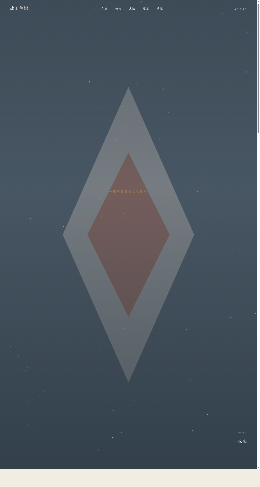

# 盐田色谱 Salt Pan Spectrum

> 日期：2026-08-17 · 方向：V1 网页设计 · 主题：海盐田文化遗产官网

## 简介

一座海盐田文化遗产的品牌/杂志站，讲述古法晒盐、盐田色谱、节气产盐与盐工故事。以雾蓝灰 + 赭红 + 盐白为主调，模拟盐田从纳潮到结晶的色谱演变。

## 配色

雾蓝灰 `#6B7B8C` · 赭红 `#B5533C` · 盐白 `#F2EDE3` · 深海墨 `#1E2A33` · 麦秆金 `#C9A24B`

## 动效亮点

- 自定义光标：弹簧积分器，外环滞后内环，赭红内点 + 多层发光
- 盐粒粒子背景：重力 + 摩擦 + 随机游走，菱形盐晶缓落
- 盐晶生长 Canvas：晶簇生长 → 脉动 → 渐隐循环
- 潮汐实时模拟、节气节点光环呼吸、工序卡片 3D 倾斜翻转

## 文件说明

| 文件 | 说明 |
|------|------|
| index.html | 完整源码（HTML/CSS/JS 内联单文件） |
| 设计规范.md | 色彩/字体/组件/动效规范 |
| preview.png | 页面截图 |

## 妙搭在线预览

https://dcniaqwtmoca.feishu.cn/page/Vw7WmslJddRk9da010zc7jw1nYg

## 技术栈

纯 HTML/CSS/JS 单文件，Canvas 2D，IntersectionObserver，requestAnimationFrame 物理积分器。
