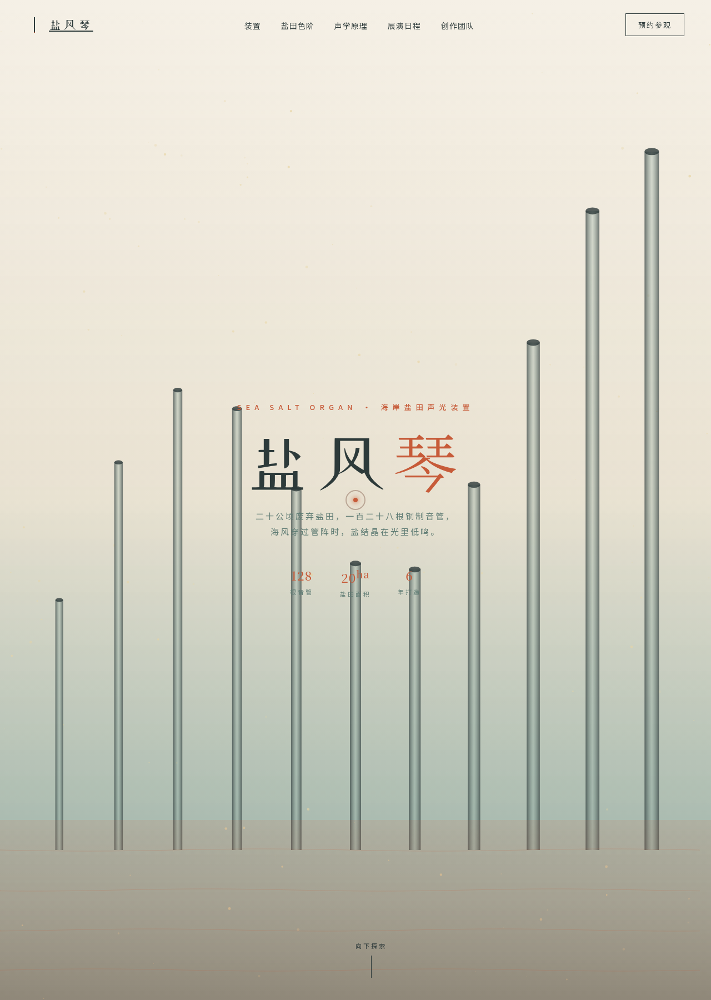

# 盐风琴 Salt Organ

> 日期：2026-08-17 · 方向：V1 网页设计 · 主题：海岸盐田声光艺术装置品牌官网

## 简介

一座建在海岸盐田蒸发池上的声光艺术装置品牌官网。海风穿过 128 根铜质风琴管发出低鸣，盐田色阶随夕阳从乳白渐变到赭红。页面围绕装置介绍、盐田色卡、声学原理、展演日程、创作团队与预约参观组织真实可交互内容。

## 截图

## 动效亮点

- 自定义光标：白环 + 赭红内点 + 多层发光，开页即居中显示，悬停放大变色，点击涟漪。
- Hero 盐晶粒子：鼠标磁性吸引 + 惯性阻尼 RAF 积分器，边界循环。
- 11 根风琴管阵：距鼠标越近发光越强，频谱波纹向上扩散，管口光晕。
- 声波可视化 Canvas：4 层叠加正弦波 + 渐变填充。
- 数字计数、打字机、3D 倾斜卡、磁性按钮、头像脉冲、光泽扫过、滚动进度条等共 14 项组件级特效。

## 文件说明

| 文件 | 说明 |
|---|---|
| index.html | 完整可运行源码（React + Babel 内联，单文件） |
| _lib/ | 本地化的 React / ReactDOM / Babel 运行时（截图用） |
| 设计规范.md | 色彩 / 字体 / 圆角 / 组件 / 动效规范 |
| preview.png | 页面截图 |
| README.md | 本说明 |

## 妙搭在线预览

https://dcniaqwtmoca.feishu.cn/page/G5xgmpPWxdrFtIaeOlOctjKMnUc

## 技术栈

React 18 + Babel standalone（JSX 全部内联），CSS 内联，无构建步骤，单文件 index.html。支持 `prefers-reduced-motion` 降级。
