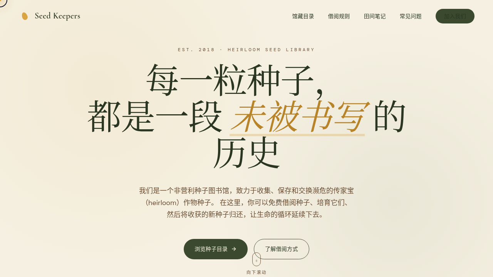

# 种子图书馆 Seed Keepers · V1 网页设计

> 日期：2026-08-17 ｜ 方向：V1 网页设计 ｜ 主题：濒危 heirloom 作物种子的公益机构品牌站

## 简介

Seed Keepers 是一个收集、保存、交换濒危 heirloom 作物种子的公益机构品牌站。围绕「种子图书馆」概念组织真实可信内容：白兰地番茄、日本蜜南瓜、蓝湖四季豆、紫佩珀甜椒、玻璃宝石玉米、罗塞塔罗勒等品种档案，配借阅规则、田间笔记与种子之声频谱。

## 截图

## 动效亮点

- 自定义光标：白环 + 芥末黄内点 + 三层发光，开页即显屏幕中央，hover 三态切换，点击涟漪
- 漂浮种子粒子：重力 + 正弦漂移 + 底部反弹，25 粒各周期不同
- 种子卡片 3D 倾斜：反平方式衰减 + 弹簧阻尼回归 + 光泽扫过
- 28 柱频谱可视化：低/中/高频不同振动，idle 呼吸 / playing 活跃两态
- 滚动渐入 / 视差 / 数字计数 / 打字机 / 手风琴等共 15 项组件级特效

## 配色

芥末黄 `#D9A441` + 深橄榄绿 `#3B4A2F` + 米白 `#F5F0E1` + 树皮棕 `#6B4F35`（大地系，无蓝紫渐变）。

## 文件说明

| 文件 | 说明 |
|---|---|
| index.html | 完整可运行单页源码（内联 CSS + Babel JSX） |
| 设计规范.md | 色彩 / 字体 / 圆角 / 组件 / 动效 / 页面结构 |
| thumbnail.png | 预览截图 |

## 妙搭在线预览

https://dcniaqwtmoca.feishu.cn/page/OId9m2MNpdT57Ka1Ck2cEvZbn5d

## 技术栈

HTML + 内联 CSS + React（Babel standalone 内联 JSX）+ Canvas / RAF 动效。
