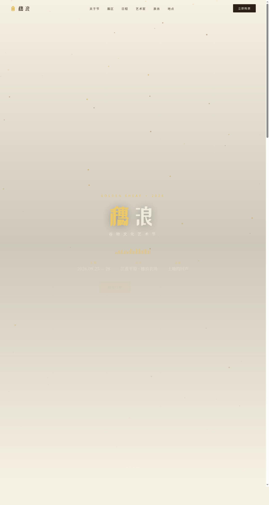

# 穗浪 Golden Sheaf · 谷物文化艺术节官网

> 日期：2026-08-17 · 方向：V1 网页设计 · 主题：谷物 / 麦田 / 土地文化艺术节

## 简介

一场关于麦田、谷物、酿酒与土地的文化艺术节官方网站。以麦浪金为主色，土壤赭与草绿作大地辅色，落在米白纸底上，呈现丰收与土地的温润质感。单页完整官网，包含 Hero、关于节、六大主题展区、四天日程、驻场创作者、票务、地点信息等板块。

## 截图

## 动效亮点

- 麦浪粒子飘落（Canvas 80+ 颗粒，相位摆动）
- 声波律动柱（24 根不等高金色音柱，各异周期）
- 自定义光标（麦浪金内点 + 多层发光 + 三态切换 + 点击涟漪）
- 3D 卡片倾斜（RAF 阻尼插值）
- Hero 视差滚动、打字机、数字计数、光泽扫过、头像脉冲

## 在线预览

[穗浪 · 谷物文化艺术节官网](https://dcniaqwtmoca.feishu.cn/page/E4NEm121CdalptazU4ycE446n9f)

## 文件说明

| 文件 | 说明 |
|------|------|
| index.html | 完整单页源码（HTML+CSS+JS 内联） |
| preview.png | 1280×2400 预览截图 |
| thumbnail.png | 平台自动缩略图 |
| 设计规范.md | 色彩/字体/组件/动效/页面结构规范 |

## 技术栈

纯 HTML + CSS + Canvas + 原生 JS（RAF 积分器、IntersectionObserver），无框架依赖。
