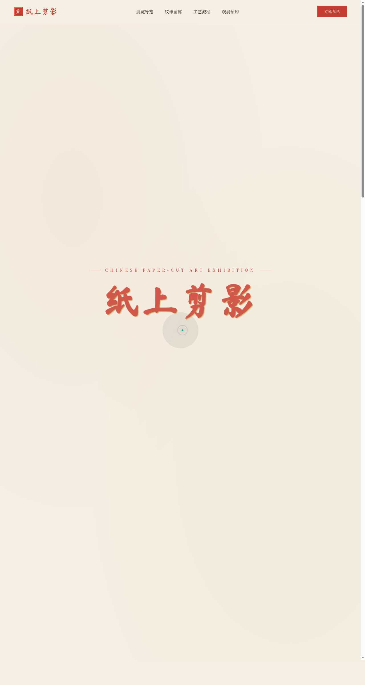

# 纸上剪影 · 中国剪纸艺术展

> 日期：2026-08-17 · 方向：V1 网页设计 · 主题：中国剪纸艺术展单页网站

## 简介

「纸上剪影」是一座可在线漫游的中国剪纸艺术展单页网站。围绕窗花、生肖、戏曲人物、吉祥纹样四大展区组织真实可信的展品内容，配合刀刻逐笔显现的标题、纸屑粒子、对称纹样展开等贴合剪纸主题语义的动效，呈现东方纸艺的刀工与光影。

## 截图

## 动效亮点

- 自定义光标：白环 + 朱红内点 + 多层发光，悬停放大变色、点击涟漪
- 英雄区剪纸刀刻逐笔描边显现（stroke-dashoffset）
- 纸屑粒子飘落（重力 + 摩擦 + 滚动联动）
- 展品灯箱放大 + 键盘方向键切换
- 预约区团花纹样匀速转动 + 鼠标反平方磁力加速
- 打字机轮播诗句、磁性按钮、数字计数、滚动视差等共 15 个组件级特效

## 配色

剪纸朱红 `#C93B2E` + 宣纸米白 `#F5EFE3` + 鎏金 `#C9A24B` + 墨黑 `#1C1A17`（禁用蓝紫渐变）。

## 文件说明

| 文件 | 说明 |
|---|---|
| `index.html` | 完整可运行源码（HTML/CSS/JS 单文件内联） |
| `preview.png` | 桌面端截图（1280×2400） |
| `thumbnail.png` | 平台生成缩略图（720×1280） |
| `设计规范.md` | 色彩 / 字体 / 组件 / 动效 / 页面结构规范 |
| `README.md` | 本说明文件 |

## 在线预览

妙搭在线预览链接：https://dcniaqwtmoca.feishu.cn/page/G1VPmIpEpdH8CSaqedEcEMlRnSh

## 技术栈

纯 HTML/CSS/JS 单文件实现，无外部框架依赖；所有动效原生 JS + RAF 实现，支持 `prefers-reduced-motion` 降级与 `visibilitychange` 自动暂停。
