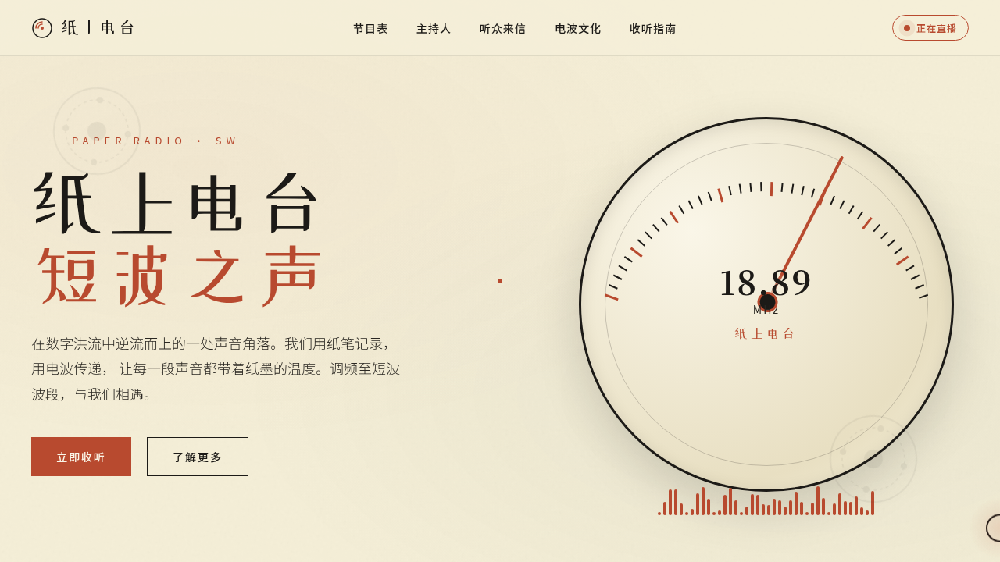

# 纸上电台 · 短波之声

> 日期：2026-08-17 · 方向：V1 网页设计 · 主题：复古短波广播电台杂志风官网

## 简介

一个复古短波广播电台的杂志风单页官网，围绕「短波之声」主题组织真实可信的中文内容：节目时间表、主持人专栏、听众来信、电波文化长文、收听指南。奶油黄纸质底 + 铁锈红主色 + 墨绿辅助，复古印刷质感。

## 截图

## 动效亮点

- 弹簧物理驱动的巨型收音机刻度盘（指针自动扫频 + 实时数字跳动）
- 40 柱声波频谱振动（多正弦波合成）
- 自定义光标（弹簧跟随 + 悬停放大 + 点击涟漪）
- 打字机标题、磁性按钮（反平方引力）、3D 卡片倾斜、数字滚动计数

## 在线预览

https://dcniaqwtmoca.feishu.cn/page/MzRUmCRUwdsWmDaoe4HcfdhKnLI

## 文件说明

| 文件 | 说明 |
|------|------|
| index.html | 完整可运行源码（HTML/CSS/JS 内联） |
| preview.png | 页面截图 |
| 设计规范.md | 色彩系统、字体、组件、动效规范 |

## 技术栈

原生 HTML/CSS/JavaScript，无框架依赖。
