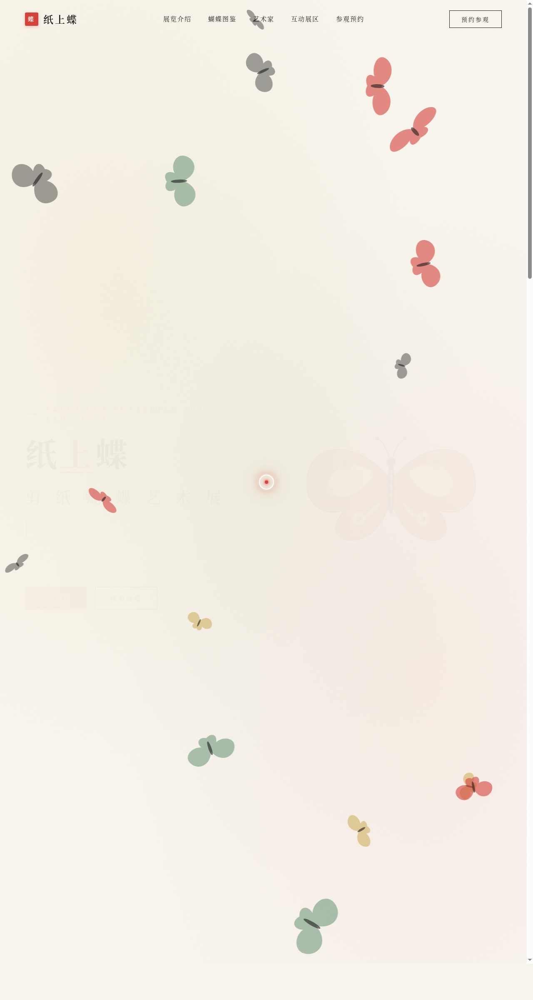

# 纸上蝶 · 剪纸蝴蝶艺术展

> 日期：2026-08-17 · 方向：V1 网页设计 · 主题：中国传统剪纸蝴蝶艺术在线展览

## 简介

一个以中国传统剪纸艺术为灵感的蝴蝶艺术在线展览网站。宣纸纹理底色、墨色衬线排版、朱砂红印章点缀、金箔装饰线，8 种用 SVG 绘制的剪纸风格蝴蝶，配合鼠标交互的飞行蝴蝶群。

## 截图

## 动效亮点

- 自定义光标（白色粗环 + 朱砂红内点 + 金箔光晕）
- Canvas 粒子蝴蝶群缓慢漂浮 + 翅膀扇动
- 蝴蝶卡片 3D 倾斜跟随鼠标
- 首屏打字机循环文案
- 数字计数器 easeOutCubic 缓动
- 悬停卡片抬升 + 顶部渐变彩条 + 印章弹跳
- 按钮光泽扫过效果
- 互动展区蝴蝶鼠标吸引 + 点击召唤
- 表单提交成功庆祝蝴蝶生成

## 文件说明

| 文件 | 说明 |
|------|------|
| index.html | 完整可运行源码（纯 vanilla HTML/CSS/JS 单文件） |
| 设计规范.md | 色彩系统、字体、动效、页面结构设计文档 |
| preview.png | 页面截图 |

## 在线预览

[纸上蝶·剪纸蝴蝶艺术展](https://dcniaqwtmoca.feishu.cn/page/INAJm3RfSdE0VTa62NLcm9r5nxf)

## 技术栈

纯 vanilla HTML/CSS/JS，零外部依赖，Canvas 粒子系统 + IntersectionObserver + CSS 动画 + rAF
