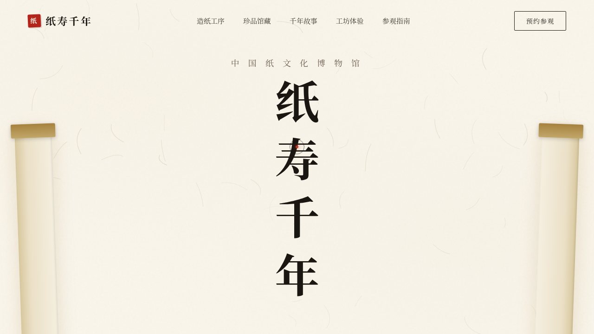

# 纸寿千年 · 中国纸文化博物馆

> 日期：2026-08-17 · 方向：V1 网页设计 · 主题：中国传统纸文化博物馆

## 简介

一座以「纸」为唯一主角的线上博物馆——从楮皮捣浆到松烟制墨，从宣纸千年寿到活字印坊，以暖纸色调与楷书衬线呈现中国纸文化的温度。单页滚动官网，真实可交互。

## 配色

宣纸米黄 `#faf6ed` / 楮皮赭 `#a7823e` / 朱砂印泥 `#b3241a` / 松烟墨 `#2c2620` / 金泥 `#d8c89e`，零蓝紫渐变。

## 截图

## 动效亮点

双层弹簧自定义光标、漂浮纸纤维粒子、Hero 竖排逐字弹跳、打字机、馆藏数字 easeOutCubic 滚动、卡片 3D 倾斜、朱砂印章旋转下压 CTA、光泽扫过、三层视差、造纸轮旋转、工序手风琴、滚动指示呼吸线，共 14 项组件级特效。

## 妙搭在线预览

https://dcniaqwtmoca.feishu.cn/page/AOE5mZvowdA5pxayxSZcIUTNnce

## 文件说明

| 文件 | 说明 |
|---|---|
| index.html | 完整可运行源码（单文件，CSS/JS 内联） |
| 设计规范.md | 色彩 / 字体 / 组件 / 动效 / 页面结构规范 |
| thumbnail.png | 页面截图 |

## 技术栈

纯 HTML + CSS + 原生 JS，单文件内联，无外部依赖，无 React/Babel。
