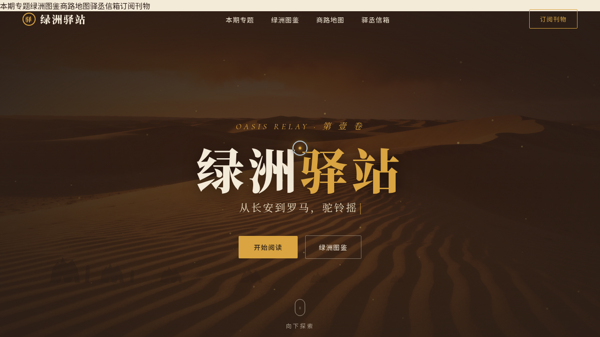

# 绿洲驿站 · 沙漠绿洲文化杂志网站

> 日期：2026-08-17 · 方向：V1 网页设计 · 主题：丝路沙漠绿洲文化线上杂志

## 简介

「绿洲驿站」是一份围绕丝路商路与绿洲文明的线上杂志网站。卷首以沙丘风纹粒子与驼队剪影开场，带读者进入沙海叙事；专题区呈现五篇深度文章，绿洲图鉴可翻转查阅六座绿洲档案，古商路交互地图串起长安至帕尔米拉六段故事，最后以驿丞信箱收束。整体沙金赤陶的暖调与夜幕棕深底形成强烈对比。

## 动效亮点

- 沙丘粒子场：Canvas 噪声流动 + 鼠标斥力，模拟风沙质感
- 打字机刊头三句循环 + 驼队剪影视差滚动
- 绿洲卡片 3D 倾斜跟随鼠标、点击翻面
- 古商路地图节点脉冲呼吸 + 故事面板联动
- 数字计数 easeOutCubic、按钮涟漪、导航栏滚动收缩
- 自定义光标：白环 + 金点 + 多层发光，开页即居中显示

## 配色

沙金 `#D9A441` / 赤陶 `#B4552D` / 绿洲碧 `#1F7A6D` / 夜幕棕 `#2B1E17` / 米白 `#F4EAD8`。

## 文件说明

| 文件 | 说明 |
|------|------|
| `index.html` | 完整可运行源码（内联 CSS + Babel JSX） |
| `thumbnail.png` | 页面截图 |
| `设计规范.md` | 色彩 / 字体 / 组件 / 动效规范 |

## 在线预览

[绿洲驿站 · 妙搭预览](https://dcniaqwtmoca.feishu.cn/page/MemtmpwwGdY2MMaotsycKHtUnNb)

## 技术栈

单文件 HTML（Canvas 2D 粒子 + IntersectionObserver + Babel JSX），无外部源码引用。
