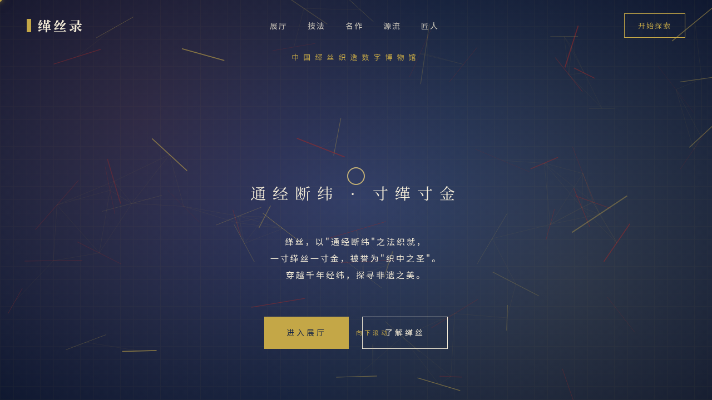

# 缂丝录 · 中国缂丝织造数字博物馆

> 日期：2026-08-17 · 方向：V1 网页设计 · 主题：中国缂丝织造数字博物馆

## 简介

缂丝录是一个展示中国非物质文化遗产「缂丝」（kèsī，以"通经断纬"技法织成的丝织品）的数字博物馆网站。以朱砂红、古金、墨蓝为主色调，营造东方古典织物的深邃华贵质感。网站包含六大虚拟展厅、交互式织机模拟器、传世名作画廊、千年时间轴和匠人列传。

## 截图展示

## 妙搭在线预览

https://dcniaqwtmoca.feishu.cn/page/Jh4wmBCOWdD0CwaHlIJc9XGinNf

## 动效亮点

- 织线粒子动画在背景中编织流动，呼应缂丝织造主题
- 织机交互模拟器：可拖动梭子、调节经线密度、切换经/纬/全景三视图
- 自定义光标：白色粗环+古金内点+多层发光，悬停可交互元素时放大变色
- 滚动驱动时间轴：从汉代到当代，滚动推进进度线与节点点亮
- 名作画廊悬停放大+纹样高亮，图片视差滚动

## 文件说明

| 文件 | 说明 |
|------|------|
| index.html | 完整单文件源码（HTML+CSS+JS） |
| 设计规范.md | 色彩系统、字体、组件规范、动效系统、页面结构 |
| preview.png | 页面截图 |
| thumbnail.png | 缩略图 |
| README.md | 本说明文件 |

## 技术栈

纯 vanilla HTML/CSS/JS 单文件实现，无外部依赖，Canvas 绘制粒子与织机模拟器。
