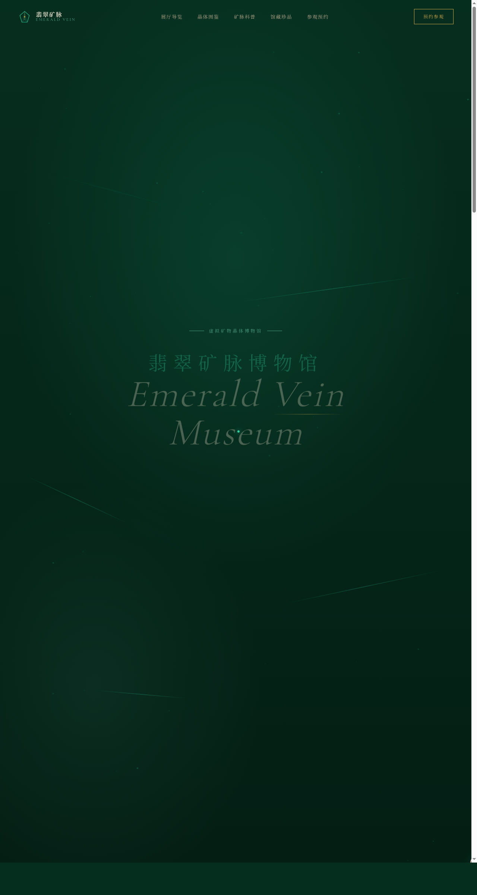

# 翡翠矿脉博物馆 · V1 网页设计

> 日期：2026-08-17 · 方向：V1 网页设计 · 主题：翡翠矿脉博物馆（虚拟矿物晶体博物馆官网）

## 简介

一个关于翡翠与宝石矿物晶体的虚拟博物馆官网。围绕"翡翠矿脉"主题组织内容——六大主题展厅、晶体标本图鉴（含分类切换）、矿脉形成科普、馆藏珍品轮播、参观预约表单，全部真实可交互。深翡翠绿底色配玉绿主色与金色点缀，营造深邃矿洞中的晶体光泽感。

## 截图

## 动效亮点

14 个组件级特效：自定义光标（白环+玉绿内点+三态+涟漪）、Canvas 矿脉粒子连线、3D 卡片弹簧倾斜、滚动渐入、悬停晶面光泽扫过、珍品打字机、数字计数 easeOutExpo、双层视差、矿脉流光脉冲、磁性按钮（反平方引力）、晶体漂浮脉冲、星芒闪烁。动效基于弹簧/阻尼/惯性物理模型与矿脉流光主题语义。

## 妙搭在线预览

https://dcniaqwtmoca.feishu.cn/page/QuiLmllUTdzNbga7UiKcN5bBnhf

## 文件说明

| 文件 | 说明 |
|------|------|
| index.html | 完整可运行源码（纯 vanilla 单文件，内联 CSS/JS） |
| preview.png | 页面截图（1280×2400） |
| thumbnail.png | 平台缩略图 |
| 设计规范.md | 色彩/字体/组件/动效/页面结构规范 |
| README.md | 本说明文件 |

## 技术栈

纯 HTML / CSS / JavaScript（vanilla，无 React / 无 Babel / 无外部 CDN 依赖），单文件 index.html。
