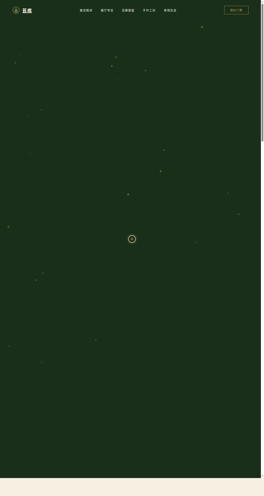

# 苔痕 Moss Trace · 苔藓微观生态艺术展

> 日期：2026-08-17 · 方向：V1 网页设计 · 主题：苔藓微观生态艺术展

## 简介

苔痕是一个沉浸式的苔藓微观生态艺术展官网。围绕苔藓的微观世界、生态美学、手作苔藓盆景、苔藓图鉴等内容，构建一个完整可交互的展览网站。配色取自天然苔藓生态——苔绿、深林墨绿、石灰岩灰、琥珀金、奶白，营造湿润幽静的森林气质。

## 截图展示

## 动效亮点

- 孢子粒子系统（Canvas + 鼠标反平方引力磁性吸附）
- 自定义光标（白色粗环 + 琥珀金内点 + 多层发光，弹簧阻尼跟随）
- 3D 倾斜卡片（弹簧积分器）
- 滚动渐入揭示 + 视差滚动
- 数字计数器 + 打字机式入场
- 声音苔藓展厅内 12 条独立频率柱频谱可视化
- 磁性按钮 + 点击涟漪 + 光泽扫过

## 妙搭在线预览

https://dcniaqwtmoca.feishu.cn/page/H0NcmQ5mWdr9q5a2iXlciSFUnYc

## 文件说明

| 文件 | 说明 |
|------|------|
| index.html | 完整源代码（纯 vanilla HTML/CSS/JS 单文件） |
| preview.png | 页面截图 |
| 设计规范.md | 设计规范文档 |

## 技术栈

纯 vanilla HTML/CSS/JS 单文件实现，零外部依赖（无 React/Babel/CDN）。
