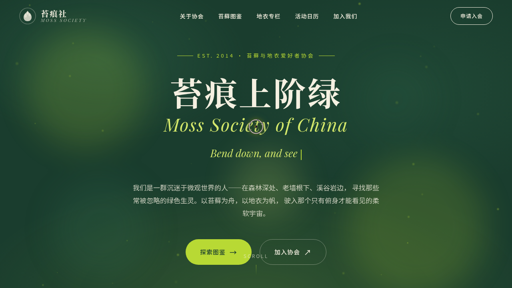

# 苔痕社 Moss Society · 网页设计

> 日期：2026-08-17 · 方向：V1 网页设计 · 主题：苔藓与地衣爱好者协会官网

## 简介

苔痕社是一个苔藓与地衣爱好者协会的官方网站，以深森林绿+黄绿+奶油的配色营造湿润苔藓森林的自然静谧感。包含协会介绍、苔藓图鉴（9 种真实苔藓）、地衣知识专栏（6 种地衣）、活动日历、会员加入等板块，所有内容真实可信，无 lorem ipsum。

## 截图

## 动效亮点

- 自定义光标（白色粗环+黄绿内点+多层发光，开页即显示在屏幕中央）
- 苔藓孢子粒子飘浮（40 颗，物理式缓升+横向摆动+呼吸透明度）
- 打字机标题（4 句中英交替循环）
- 数字计数动画（easeOutCubic）
- 滚动渐入 + 视差滚动 + 导航栏变色
- 卡片光泽扫过 + 涟漪点击 + 苔藓纹理生长

## 文件说明

| 文件 | 说明 |
|------|------|
| index.html | 完整可运行源码（纯 HTML/CSS/JS 单文件，零外部依赖） |
| 设计规范.md | 色彩系统、字体、组件规范、动效系统、页面结构 |
| thumbnail.png | 页面截图 |

## 妙搭在线预览

https://dcniaqwtmoca.feishu.cn/page/LSAmmPQAIdAJIMayRigc4WQQnLe

## 技术栈

纯 HTML / CSS / JavaScript（单文件，无 React / 无 Babel / 无 CDN 依赖）
