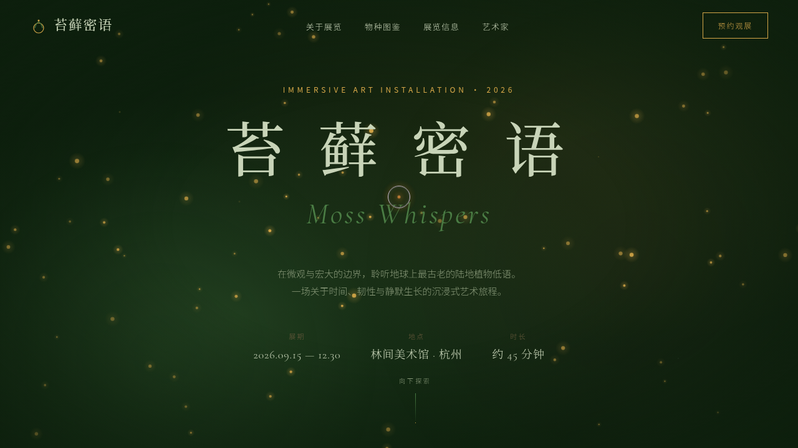

# 苔藓密语 · Moss Whispers

> 日期：2026-08-17 · 方向：V1 网页设计 · 主题：苔藓微观生态艺术装置展览官网

## 简介

「苔藓密语」是一个沉浸式艺术装置展览的官方网站，以苔藓——地球上最古老的陆地植物之一——的微观之美为主题。网站通过孢子粒子系统、苔藓生长 SVG 动画、有机形态圆角等视觉语言，营造出湿润、幽静、充满生命力的森林氛围。

## 截图

## 设计说明

- **配色**：深森林绿（#0d1f0d）为主背景，苔藓绿（#4a7c44）为主色，金色孢子（#d4a648）为强调色，石灰岩（#2a2a24）为表面色，淡苔（#c8d4b8）为浅文字
- **字体**：Noto Sans SC
- **视觉层次**：9 阶绿色渐变 + 金色点缀，营造苔藓从暗到亮的生长层次
- **有机形态**：使用不规则圆角（50% 50% 45% 55%）模拟自然形态

## 动效亮点

1. **孢子粒子系统** — Hero 区 canvas 物理模拟（浮力+布朗运动），孢子缓缓飘散
2. **自定义光标** — 白色粗环+金色内点+多层发光，悬停放大变色，点击涟漪
3. **苔藓生长 SVG** — path 描边动画模拟苔藓蔓延生长
4. **卡片 3D 倾斜** — 鼠标位置驱动 perspective 变换，直接操作 DOM
5. **打字机效果** — 艺术家手记逐字显现 + 签名淡入
6. **数字计数** — 4.7 亿年/12000 物种/45 分钟从 0 计数

## 妙搭在线预览

https://dcniaqwtmoca.feishu.cn/page/VQSomql4xd66A7a9AodcGz3Mn4b

## 文件说明

| 文件 | 说明 |
|------|------|
| `index.html` | 完整可运行源代码（纯 vanilla HTML/CSS/JS 单文件） |
| `preview.png` | 页面截图 |
| `thumbnail.png` | 缩略图 |
| `设计规范.md` | 设计规范文档 |

## 技术栈

- 纯 vanilla HTML/CSS/JS（无 React/Babel/CDN 依赖）
- Canvas 2D API（孢子粒子系统）
- SVG（苔藓生长动画）
- IntersectionObserver（滚动渐入）
- CSS backdrop-filter（导航毛玻璃）
