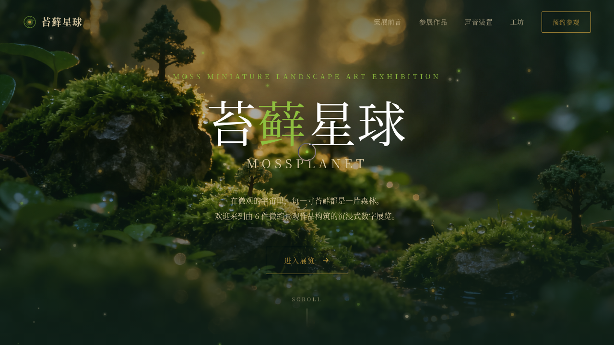

# 苔藓星球 Mossplanet · V1 网页设计

> 日期：2026-08-17 ｜ 方向：V1 网页设计 ｜ 主题：苔藓微缩景观艺术展官网

## 简介

「苔藓星球 Mossplanet」是一座以苔藓微缩景观为主题的沉浸式数字展览馆官网。策展前言逐字浮现，6 件微缩苔藓景观作品以 3D 倾斜卡片陈列，声音装置区用 48 根声波柱可视化苔藓生长的环境音，工坊区有 SVG 苔藓生长描边动画，底部为参观预约入口。整体深苔绿底 + 黄绿/暗金点缀，潮湿苔藓质感。

## 截图

## 动效亮点

- 自定义光标：白环 + 黄绿内点 + 多层发光，中心即显，悬停变形 + 点击涟漪
- 苔藓孢子布朗运动粒子飘浮
- 作品卡 3D 倾斜悬停（直操 transform）+ 光泽扫过
- 声波柱三频正弦叠加振动
- SVG 苔藓生长描边动画
- 策展前言打字机 + 数字计数 + Hero 视差 + 导航吸顶变色

## 文件说明

| 文件 | 说明 |
|------|------|
| index.html | 完整可运行源码（单文件，CSS/JS 内联） |
| 设计规范.md | 色彩系统、字体、组件、动效、页面结构 |
| preview.png / thumbnail.png | 页面截图 |
| README.md | 本说明文件 |

## 妙搭在线预览

https://dcniaqwtmoca.feishu.cn/page/ZRL7mX4iuduxwhaX4e2czev2nkh

## 技术栈

纯 vanilla HTML/CSS/JS 单文件，无 React/Babel/外部 CDN 依赖。
