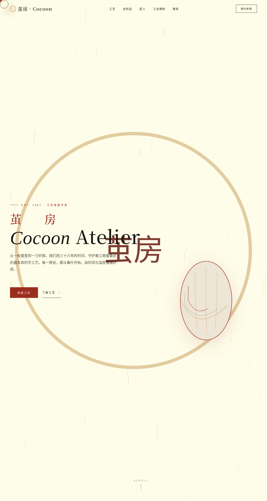

# 茧房 Cocoon Atelier · 蚕桑丝织工坊官网

> 日期：2026-08-17 · 方向：V1 网页设计 · 主题：蚕桑丝织手工艺工坊
> 配色：米白 #F5EFE6 + 绛红 #9B2D20 + 墨黑 #1A1614 + 暖金 #C8A14B + 蚕青 #A8B89F（无蓝紫渐变）

## 简介

「茧房 Cocoon Atelier」是一件艺术品级的蚕桑丝织手工艺工坊官网单页 mock。围绕从蚕茧到丝织的完整手工艺过程组织内容：工艺四步（育蚕/剥茧/缫丝/织造）、丝织品画廊（可按丝巾/面料/成衣筛选）、三位守艺人故事、工坊课程预约。整体米白纸感底 + 绛红品牌色 + 暖金装饰，营造温润的手工艺质感。

## 截图

## 动效亮点

- 自定义光标（白环 + 绛红内点 + 金色光晕，弹簧物理跟随，三态切换，点击涟漪）
- 蚕丝飘动粒子 Canvas（波动曲线 + 鼠标反平方引力）
- 茧 SVG 脉动 + 3D 磁性倾斜
- 打字机循环四句蚕丝古诗
- 磁力按钮 / 数字计数 / 织机经纬视差 / 匠人头像脉冲 等 14 个组件级特效

## 文件说明

| 文件 | 说明 |
|------|------|
| index.html | 完整可运行源码（纯 HTML/CSS/JS 单文件，无外部依赖） |
| 设计规范.md | 色彩系统、字体、组件、动效、页面结构 |
| preview.png | 页面截图 |
| thumbnail.png | 平台生成缩略图 |

## 妙搭在线预览

https://dcniaqwtmoca.feishu.cn/page/LSEymrclDdTbtYaq46rcPWX0nPe

## 技术栈

纯 HTML / CSS / JavaScript 单文件实现，无 React / Babel / 外部 CDN 依赖。Canvas 粒子 + SVG 动画 + IntersectionObserver 滚动触发 + RAF 物理积分器。
