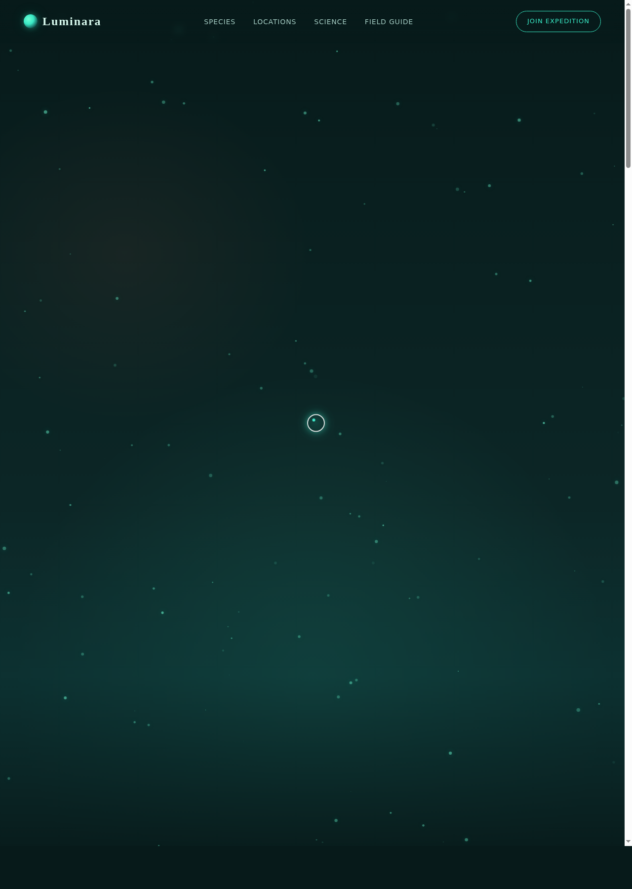

# 荧光海湾·生物发光图鉴 Luminara

> 日期：2026-08-17 · 方向：V1 网页设计 · 主题：深海生物发光科普图鉴网站

## 简介

Luminara 是一个以"荧光海湾"为主题的生物发光科普图鉴网站，展示全球发光生物物种、荧光海湾位置、生物发光科学原理与野外观赏指南。整体视觉以深墨青底色搭配生物荧光青绿色，营造深海暗境中忽然亮起荧光的神秘氛围。

## 配色

深墨青（#071a1a）+ 生物荧光青（#39e8c4）+ 珊瑚橙（#ff7a59）+ 琥珀金（#ffc857），完全避开蓝紫渐变。

## 动效亮点

- 自定义光标（三层发光 + 悬停形变 + 点击涟漪）
- Canvas 浮游粒子系统（120 颗粒子脉冲上升）
- 海湾波浪 Canvas 动画（三层正弦波）
- 卡片 3D 倾斜跟随鼠标
- 数字计数 easeOutCubic 动画
- 滚动渐入揭示 + 导航吸顶变色
- 打字机入场 + Logo 呼吸发光
- 科学原理轨道旋转 + 光子迸发

## 截图

## 妙搭在线预览

https://dcniaqwtmoca.feishu.cn/page/LQKsmkXWPdCMeda53aFc0780nCe

## 文件说明

| 文件 | 说明 |
|------|------|
| index.html | 完整单文件源码（HTML + CSS + JS 内联） |
| 设计规范.md | 色彩系统、字体、组件、动效规范 |
| preview.png | 页面截图 |
| README.md | 本说明文件 |

## 技术栈

纯 vanilla HTML/CSS/JS 单文件实现，零外部依赖。Canvas 2D 粒子系统，IntersectionObserver 滚动揭示，CSS 动画 + RAF 动画循环。
