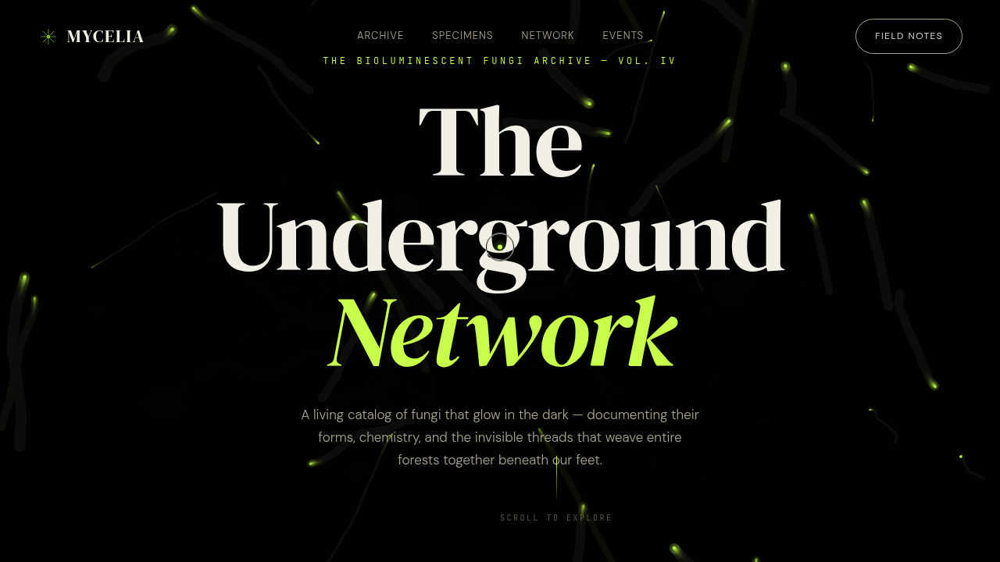

# MYCELIA · 生物荧光真菌数字档案

> 日期：2026-08-17 · 方向：V1 网页设计 · 主题：夜光蘑菇田野考察档案站

## 简介

「MYCELIA」是一个以夜光蘑菇田野考察为主题的生物荧光真菌数字档案官网。围绕生物荧光物种档案、菌丝网络信号可视化、生物发光频谱、考察日志组织真实可信内容，做成一件艺术品级单页网站。深森林黑底 × 生物荧光酸橙绿 × 鸡油菌金黄配色，完全避开蓝紫渐变。

## 截图

## 动效亮点

- 自定义光标（白环+绿点+多层发光，开屏即居中，悬停三态切换，点击涟漪）
- 孢子粒子系统（重力+布朗运动+正弦气流+摩擦阻尼）
- 标本卡片 3D 倾斜磁吸 + 生物发光呼吸 + 光泽扫过
- 菌丝网络 SVG 信号传播 + 节点脉冲
- 生物发光频谱柱（正弦叠加+高斯包络）
- 打字机标题、数字计数器、滚动视差、导航收缩毛玻璃、滚动渐入级联（共 17 项组件级特效）

## 文件说明

| 文件 | 说明 |
|------|------|
| index.html | 完整可运行源码（HTML+CSS+JSX 全内联） |
| 设计规范.md | 色彩系统、字体、组件、动效、页面结构 |
| preview.png | 页面截图 |

## 妙搭在线预览

https://dcniaqwtmoca.feishu.cn/page/A9yjmXRrEdl7moadb18cheqbnke

## 技术栈

React（JSX 内联于 `<script type="text/babel">`）+ 内联 CSS + Babel standalone，单 HTML 文件。
